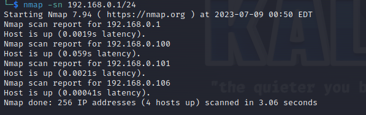

# 一、虚拟机配置

1. 作者说需要手动修改虚拟机mac地址
    
2. 如果vmware版本太新的话，导入靶机ovf的时候会提示ovf合规错误
    
3. 点击重试，导入后不要直接修改设置，右键虚拟机——>管理——>更改硬件兼容性，将兼容性修改为16.x，克隆虚拟机即可，然后就可以在设置——>网络适配器——>高级中通修改虚拟机的mac地址了
    

# 二、信息收集

1. 主机发现，如下，192.168.0.101就是靶机
    

2. 端口扫描
   
   ```shell
   nmap -sC -sV -T4 192.168.0.101
   ```
   
    

3. 发现只有一个80端口，web中间件是Apache httpd 2.2.15，系统CentOS，DAV版本2，PHP版本5.3.3，存在robots.txt文件，先用nmap扫描一下是否有漏洞，没有发现什么漏洞，打开web站点看一下
    

4. 看一下robots.txt文件，发现有三个目录
   
    

5. 三个目录都是同一张图片，没有其它东西
    

6. 没有其它东西了，图片中提到了一个域名memegenerator.net，修改host解析后发现也没有什么东西，再回顾一遍，发现首页多次提到一个fristi，访问一下这个URL看看，发现是一个登录界面
    

7. F12发现源码中有一个base64编码的图片和一个注释，先保存下来
    

8. 似乎没有注入，尝试弱口令也没有成功，尝试base64解码上面的注释，发现是也是一张图片
    

9. 使用注释中的字符替换base64编码的图片，发现源码中第一个center标签中还有有一个注释，其中提到了开发者的名字
    

10. 使用如下口令登录网站，发现后台有文件上传
    
    ```shell
    eezeepz
    keKkeKKeKKeKkEkkEk
    ```
    
    

# 三、getshell

1. 发现文件上传存在校验
   
    

2. 给文件添加一个.jpg的后缀，上传php-reverse-shell.php，如下，上传成功
    

3. kali开启监听，web访问php-reverse-shell.php.jpg文件，如下，成功获取shell
    

# 四、权限提升

1. 查看内核版本，如下，为linux Red Hat 2.6.32
   
    

2. 搜索该内核的漏洞，如下，有两个漏洞
    

3. cd到/var/www/html目录
   在fristi下发现checklogin.php文件，cat发现里面有mysql账号密码，不是root权限的，数据库中也没有什么东西
    

4. 使用脏牛提权，将脚本上传到靶机
    

5. 编译exp并创建一个新的超级管理员用户
   
   ```shell
   gcc -pthread 40839.c -o dirty -lcrypt
   ./dirty xiaodi #xiaodi是新建用户的密码
   ```
   
    

6. 随后切换到firefart用户，结果提示standard in must be a tty，需要切换到交互式shell，然后切换到firefart用户，成功获取root权限
   
   ```shell
   python -c 'import pty;pty.spawn("/bin/bash")'
   su firefart
   ```
   
    
