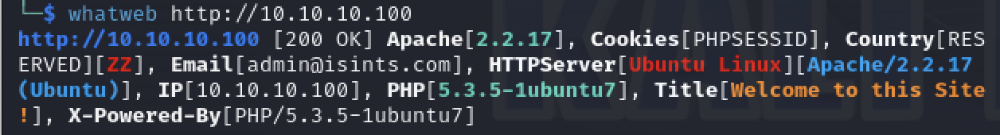

# 一、信息收集

1. 主机发现
   
   ```shell
   sudo arp-scan -l
   ```
   
   

2. 端口扫描
   
   ```shell
   nmap -p- -sV -sC 10.10.10.100
   ```
   
   

3. 发现开放了80端口，识别一下web指纹
   
   

4. 访问一下web，在home界面下发现管理员邮箱admin@isints.com
   
   

5. 还有一个注册界面，注册一个账号
   
   

6. 点击激活连接激活账号
   
   

7. 登陆后发现什么也没有，测试一下登录框，发现邮箱地址输入框存在SQL注入
   
   

8. 使用sqlmap跑注入点，成功获取到管理员账号密码
   
   

9. 解密密码的md5值，成功获取密码killerbeesareflying
   
   

10. 但是这个管理员账号似乎没什么用，使用gobuster扫描一下目录
    
    

11. 发现存在/blog、/info、/cgi-bin目录，先看一下/info目录，发现是一个phpinfo
    
    

12. /blog目录是一个博客界面，f12看到使用的源码为Simple PHP Blog 0.4.0
    
    

# 二、getshell

1. 使用sqlmap获取os-shell和上传脚本反弹shell都失败了，思路换到blog上，searchsploit搜索一下Simple PHP Blog
   
   

2. 发现存在多个代码执行，使用1191.pl进行测试，但是当前版本的perl已经放弃了switch模块，多次尝试后安装失败，应该是网络原因，没办法只好上msf了
   
   ```shell
   msfconsole
   search Simple PHP Blog 0.4.0
   use 0
   set rhosts 10.10.10.100
   set uri /blog
   exploit
   ```
   
   

3. 成功获取www-data权限shell

# 三、权限提升

1. shell受限，执行不了什么命令，好在知道了网站的绝对路径，使用cat命令发现了两个mysqli配置文件
   
   

2. 最后使用第二个配置文件中的密码：root@ISIntS成功连接ssh，获取到root权限
   
   
