# 一、信息收集

1. 主机发现
   
   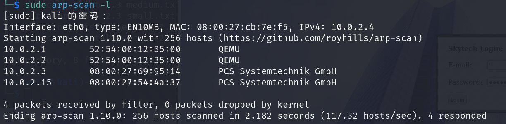

2. 端口扫描，开放了22、80、3128端口，3128端口为http-proxy
   
   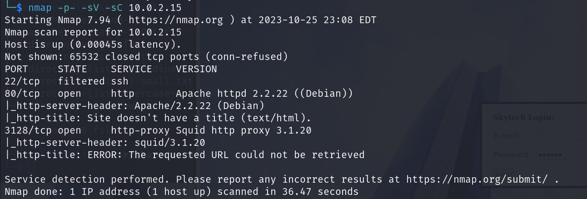

3. 发现有web服务，识别一下指纹
   
   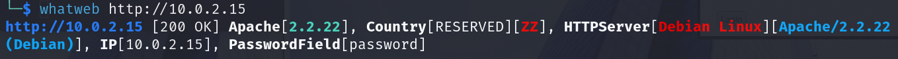

4. 扫描一下目录
   
   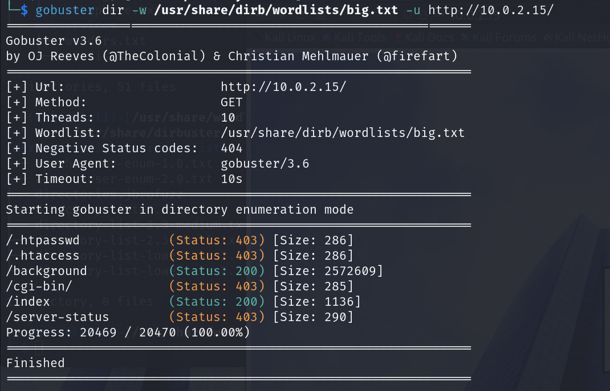

5. 访问一下网站，/index是登陆界面，/background是一张图片
   
   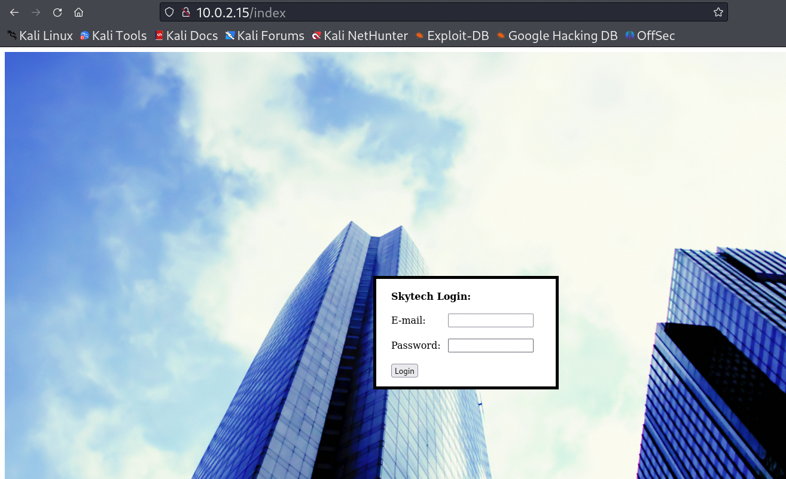

# 二、getshell

1. 登陆框email处存在sql注入
   
   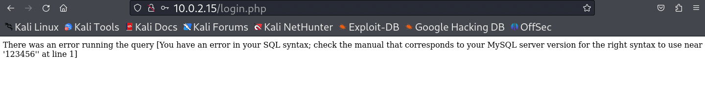

2. 过滤了=，使用||绕过
   
   ```sql
   ' || 1=1 #
   ```
   
   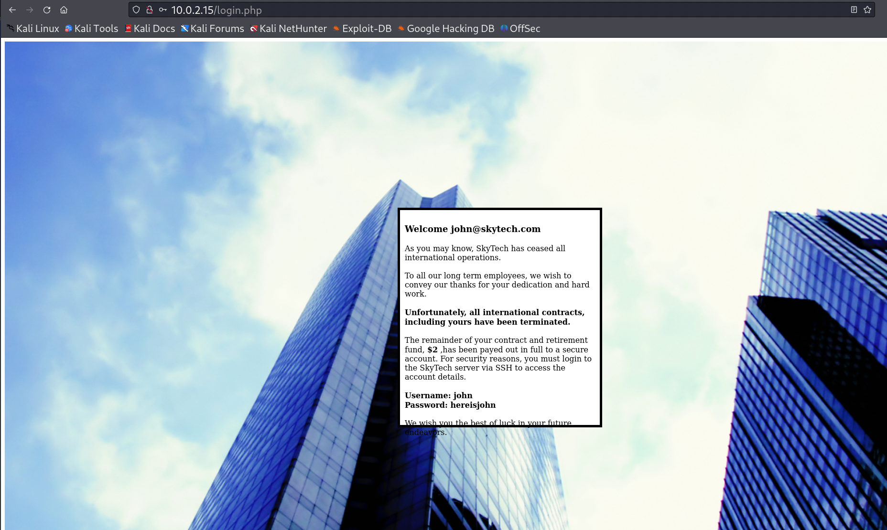

3. 登陆后发现有一个ssh用户名密码
   
   ```shell
   Username: john
   Password: hereisjohn
   ```

4. 尝试使用该口令登陆ssh，结果无法连接，前面端口扫描时发现主机的3128端口有http-proxy服务，可以利用该服务将ssh通过http代理隧道转发到127.0.0.1:1234上，通过http隧道尝试连接ssh
   
   ```shell
   proxytunnel -p 10.0.2.15:3128 -d 127.0.0.1:22 -a 1234
   ```
   
   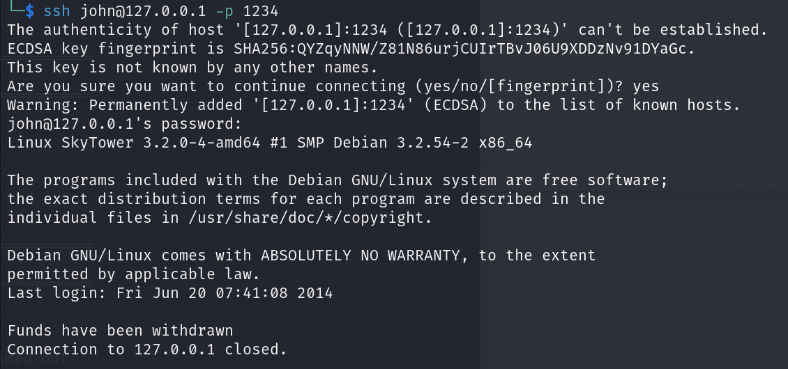

5. 结果又报错了，在命令后加上/bin/bash指定执行bash shell，成功获取shell
   
   ```shell
   ssh john@127.0.0.1 -p 1234 /bin/bash
   ```
   
   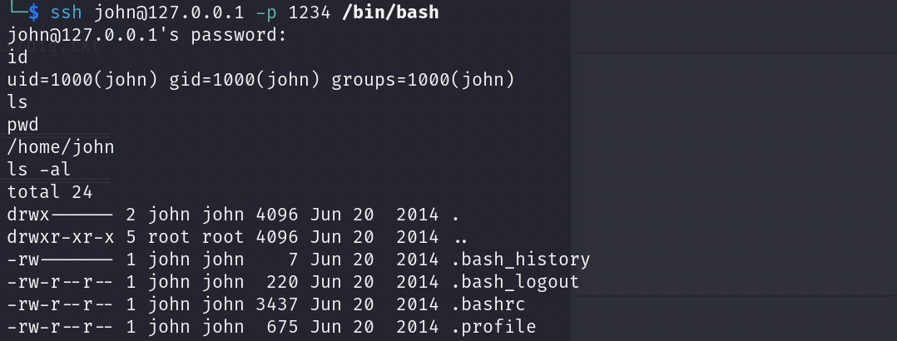

# 三、权限提升

1. 经过一番查找，在/var/www目录下找到了web源码，在login.php中发现了mysql口令
   
   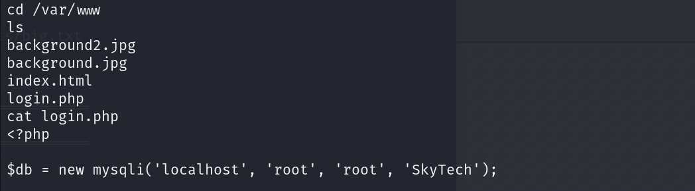

2. 尝试登陆mysql发现不能正常秩序sql语句，猜测是shell受限，网上查找了一番资料，发现修改bash文件即可实现对指定用户shell进行限制
   
   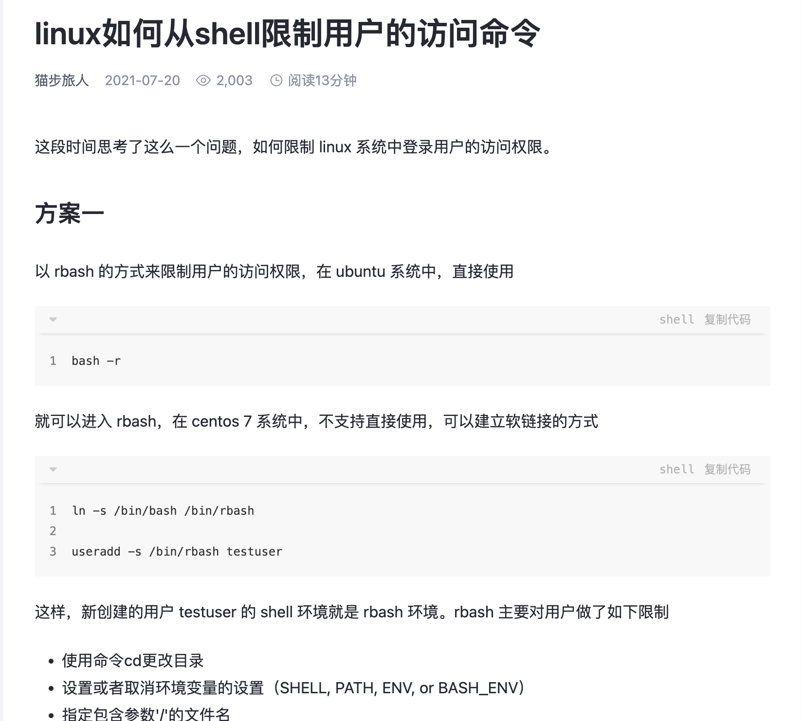

3. 在/home/john目录下发现有.bashrc文件，该文件相当于bash shell的配置文件，将该文件删除，再次登陆ssh，成功获取完整的shell环境
   
   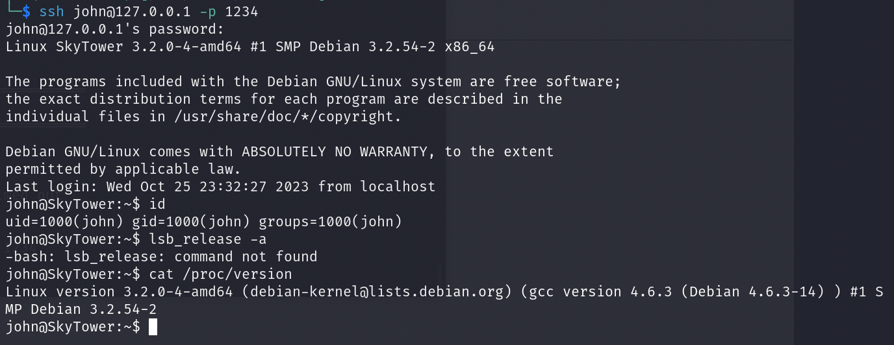

4. 再次登陆mysql，在SkyTech库下发现一个login表，在login表中找到了几个用户信息
   
   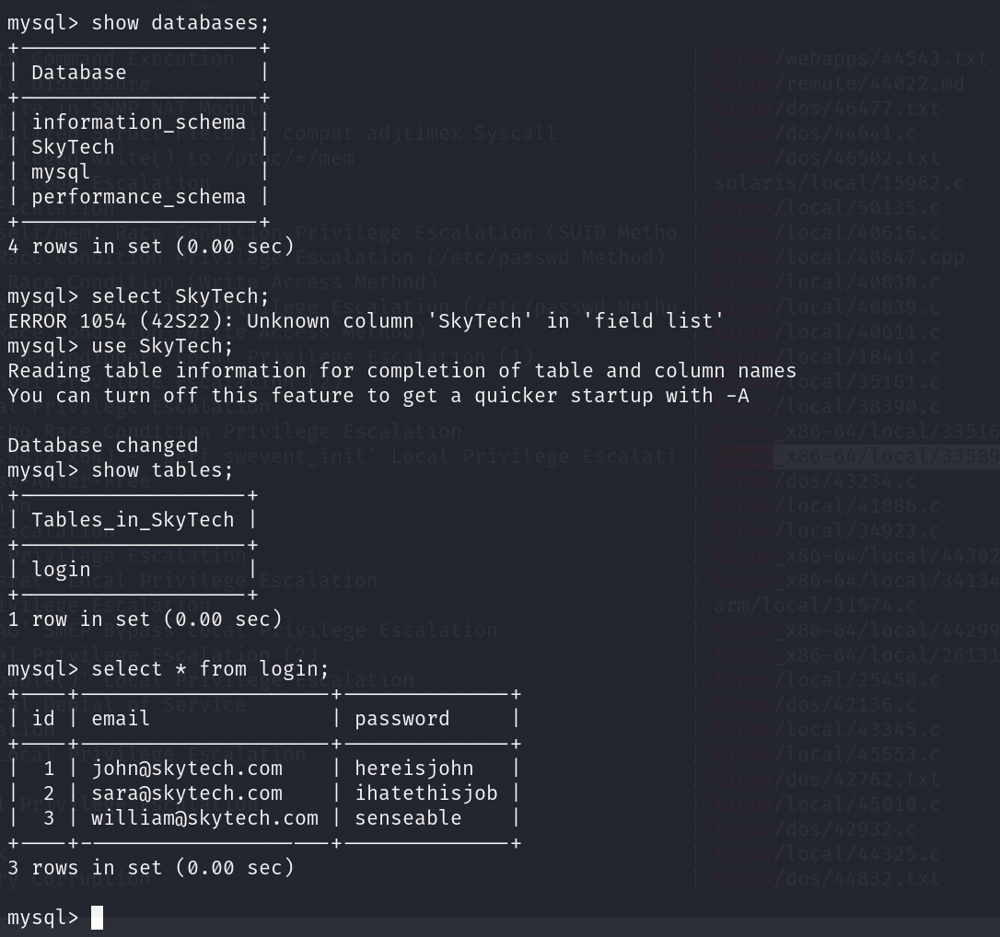

5. 退出john，使用sara指定bash shell登陆ssh
   
   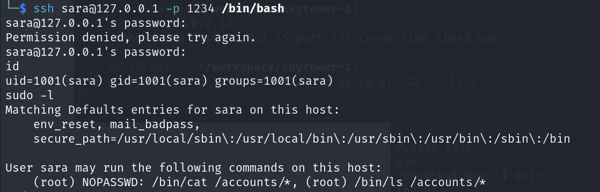

6. 发现shell同样受限，但是可以执行sudo -l，删除.bashrc文件，然后重新登陆，发现不能通过sudo su获取root权限，从上面的sudo -l看到可以无密码使用cat命令和ls命令，利用sudo ls 和sudo cat成功读取到/root目录下的文件，flag.txt文件中存在root用户密码
   
   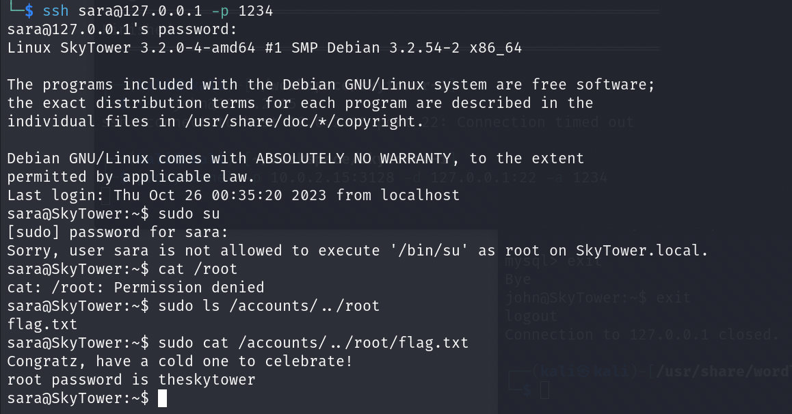
